# Laporan Praktikum Sistem Operasi Jobsheet 910
<h4> Nama   : Ahmad Rafid Riqkullah <h4>
<h4> NIM    : 254107020078 <h4>
<h4> Kelas  : TI-1G <h4>

# Manajemen Memori & System Call
## 1.1 Arsitektur Memori di Linux
### Praktikum 10.1 Melihat Penggunaan Memori
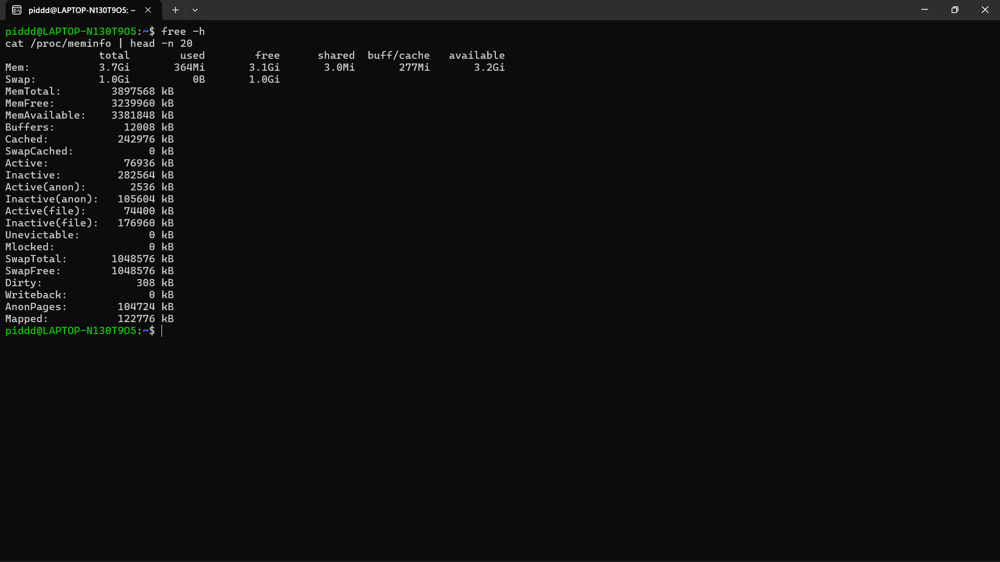
- Analisis:
1. Hitung persentase memori tersedia: available / total × 100%. Jika hasilnya di bawah 10%, sistem mulai kekurangan memori.
2. Pada baris Swap, apakah kolom used bernilai 0? Jika lebih dari 0, kernel sudah pernah memindahkan data ke disk karena RAM tidak cukup.
3. Perhatikan field Cached dan Buffers di /proc/meminfo. Nilai ini sesuai dengan kolom buff/cache pada free -h.
- **Jawab:**
1. Berdasarkan output `free -h` dan `/proc/meminfo`, MemAvailable adalah 3381848 kB dan MemTotal adalah 3897568 kB. Jika dihitung persentasenya: (3381848 / 3897568) × 100% = **86,7%**. Hasilnya jauh di atas 10%, yang berarti sistem sangat normal dan RAM sangat lega.
2. Pada baris Swap di perintah `free -h`, kolom `used` bernilai **0B**. Hal ini berarti kernel belum memindahkan data apa pun ke disk (swap) karena kapasitas RAM fisik masih sangat mencukupi.
3. Ya, nilainya saling berkaitan. Di `free -h`, `buff/cache` tercatat 277Mi. Jika dijumlahkan secara manual dari `/proc/meminfo`, nilai `Buffers` (12008 kB) ditambah `Cached` (242976 kB) adalah sekitar 254984 kB (≈ 249 MiB). Perbedaan kecil terjadi karena `free -h` juga memperhitungkan `SReclaimable` ke dalam hitungan total cachenya.

#### Studi Kasus 10.1 Server Lambat karena Memori
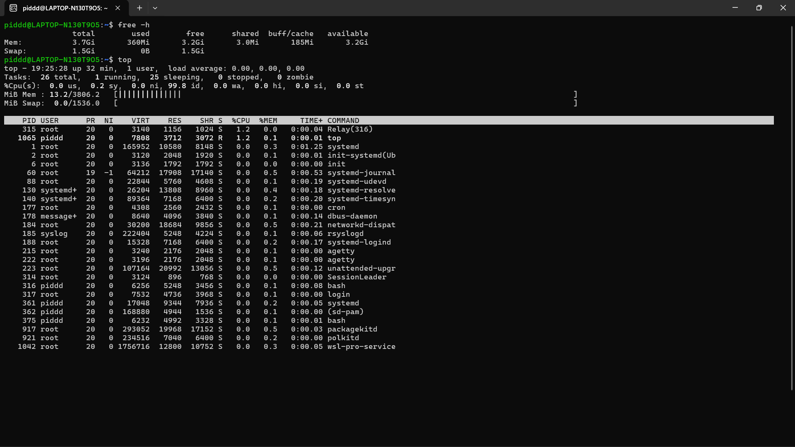
- Analisis:
1. Apakah nilai available sangat kecil (misalnya di bawah 200 MB pada server dengan RAM 2 GB)? Jika ya, server kemungkinan kekurangan memori.
2. Apakah kolom used pada baris Swap lebih dari 0? Jika ya, kernel sedang menggunakan swap, yang berarti performa menurun.
3. Di tampilan top, proses apa yang memiliki %MEM terbesar? Proses tersebut menjadi kandidat utama penyebab lambatnya server.
- **Jawab:**
1. Tidak, nilai `available` pada output `free -h` sangat besar, yaitu **3.2Gi** (GigaBytes). Server dipastikan tidak sedang kekurangan memori.
2. Tidak, kolom `used` pada baris Swap bernilai **0B**. Karena kernel tidak menggunakan swap sama sekali, performa server tidak mengalami penurunan akibat *paging* disk.
3. Di dalam tampilan `top` dan `ps aux`, proses dengan `%MEM` terbesar diduduki bersama oleh `/usr/bin/python3 /usr/share/unattended-upgrades...` (PID 223), `packagekitd` (PID 917), dan `systemd-journald` (PID 60), yang masing-masing hanya memakan **0.5%** memori. Karena angka ini sangat kecil, lambatnya server dipastikan bukan berasal dari beban proses-proses tersebut melainkan faktor lain (seperti CPU, jaringan, atau I/O disk).

## 1.2 Manajemen Memori Virtual
### Praktikum 10.2 Mengamati Aktivitas Paging
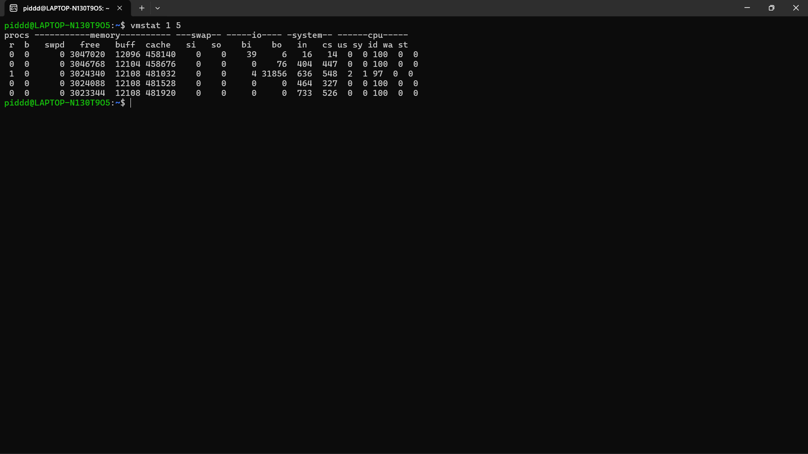
- Analisis:
1. Amati nilai si dan so pada kelima baris. Pada sistem normal dengan RAM cukup, kedua nilai ini selalu 0.
2. Jika nilai si atau so sesekali muncul lebih dari 0, artinya pernah ada aktivitas swap. Ini masih wajar jika tidak terus-menerus.
3. Jika si dan so terus-menerus lebih dari 0, sistem dalam kondisi memory pressure serius — performa turun drastis karena akses disk jauh lebih lambat dari RAM.
4. Perhatikan juga kolom free (RAM kosong) dan buff (buffer) untuk memahami kondisi keseluruhan RAM saat itu.
- **Jawab:**
1. Nilai `si` (swap in) dan `so` (swap out) pada kelima sampel semuanya menunjukkan angka **0**. Ini membuktikan sistem beroperasi secara normal tanpa adanya perpindahan memori ke disk.
2. Jika angka `si` atau `so` sesekali muncul > 0, itu merupakan hal yang lumrah pada sistem yang sudah berjalan lama. Kernel kadang men-swap halaman memori yang lama tak tersentuh untuk memaksimalkan ruang RAM bagi *cache*.
3. Jika nilainya tinggi terus-menerus, server akan mengalami *memory pressure* dan performanya anjlok karena kecepatan baca/tulis *hard disk/SSD* jauh tertinggal dibandingkan cip RAM.
4. Kolom `free` menunjukkan angka yang stabil di atas 3 juta KB (~3 GB) dan kolom `buff` sekitar 12 MB, menandakan kapasitas RAM sistem masih tersisa sangat luas.

## 1.3 Konfigurasi Swap Space
### Praktikum 10.3 Membuat dan Mengonfigurasi Swap File
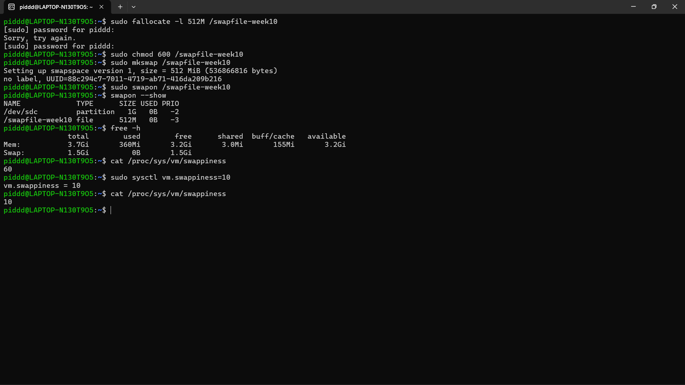
- Analisis:
1. Berapa nilai swappiness default? Apa artinya bagi perilaku kernel dalam menggunakan swap?
2. Setelah diubah ke 10, konfirmasi nilai berubah pada output cat kedua. Apa dampak nilai 10 terhadap penggunaan swap dibanding nilai 60?
3. Apakah entri /swapfile-week10 muncul di swapon –show? Jika tidak, pastikan Langkah 2 (chmod 600) sudah dijalankan sebelum Langkah 3.
- **Jawab:**
1. Nilai *swappiness* default adalah **60**. Artinya, kernel bertindak cukup berimbang dan agresif: ia akan mulai memindahkan data dari RAM ke swap file untuk menyediakan lebih banyak ruang bagi *cache* file, meski RAM belum sepenuhnya habis.
2. Setelah perintah `sysctl vm.swappiness=10` dieksekusi, nilai pada output `cat` kedua berubah menjadi **10**. Dampaknya, kernel kini akan jauh lebih enggan menggunakan swap. Ia akan mati-matian menahan seluruh data di dalam RAM utama dan hanya akan menggunakan swap jika RAM benar-benar dalam keadaan kritis/habis terpakai.
3. Ya, `/swapfile-week10` muncul pada output `swapon --show` dengan ukuran 512M. Hal ini berarti langkah memformat dan pengubahan *permission* sebelumnya (ke `600`) telah dieksekusi dengan benar dan aman.

## 1.4 Pemantauan Penggunaan Memori
### Praktikum 10.4 Monitoring Memory
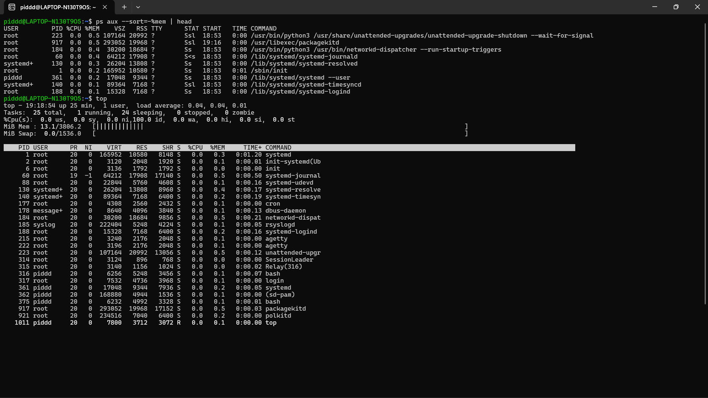
- Analisis:
1. Proses apa yang berada di urutan pertama? Catat nilai %MEM dan RSS-nya.
2. Konversikan RSS dari KB ke MB (bagi 1024). Misalnya, RSS=524288 berarti proses menggunakan 512 MB RAM. Apakah wajar untuk jenis program tersebut?
3. Mengapa VSZ selalu lebih besar dari RSS pada proses yang sama?
4. Apakah urutan proses di ps konsisten dengan tampilan top saat diurutkan berdasarkan %MEM?
- **Jawab:**
1. Proses di urutan pertama (berdasarkan pengguna memori tertinggi di `ps aux`) adalah `/usr/bin/python3 /usr/share/unattended-upgrades...` dengan nilai **%MEM** sebesar **0.5** dan **RSS** sebesar **20992** KB.
2. Jika dikonversi, 20992 / 1024 = **20,5 MB**. Penggunaan RAM sebesar 20,5 MB sangat wajar untuk ukuran skrip utilitas pembaruan berbasis Python yang berjalan di sistem.
3. **VSZ** (Virtual Memory Size) selalu lebih besar karena mencakup keseluruhan alokasi memori yang diklaim/diminta oleh program, termasuk seluruh *library* dan blok memori kosong yang belum dipetakan secara fisik. Sementara **RSS** (Resident Set Size) murni hanya memori fisik RAM yang sedang aktif terisi data proses tersebut.
4. Ya, persentase `%MEM` konsisten. Meskipun pada gambar output `top` belum diurutkan berdasarkan memori (masih bawaan urutan *PID* karena tombol 'M' belum ditekan), nilai kolom `%MEM` untuk proses-proses tersebut (seperti PID 60 dan 223) tetap akurat di angka 0.5% seperti pada perintah `ps`.

### raktikum 10.5 Script Monitor Memori
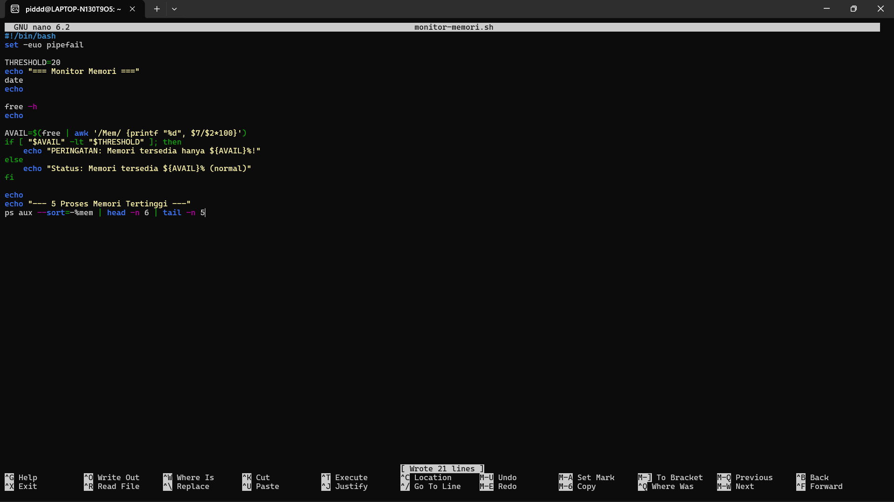
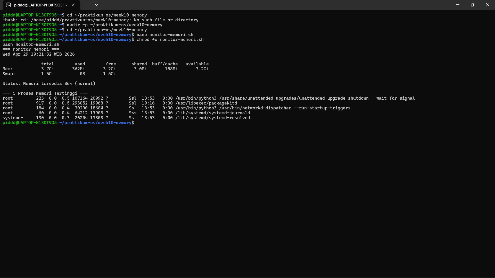
- Analisis
1. Variabel THRESHOLD=20 menetapkan batas persentase. Perintah free | awk ’/Mem/ {printf "%d", $7/$2*100}’ mengambil kolom ke-7 (available) dibagi kolom ke-2 (total) dari baris Mem, lalu dikalikan 100 untuk menghasilkan persentase bilangan bulat.
2. Kondisi if [ "$AVAIL" -lt "$THRESHOLD" ] bernilai benar jika persentase memori tersedia di bawah 20.
3. Ubah THRESHOLD menjadi 90 dan jalankan ulang. Apa yang berubah pada output? Mengapa demikian?
- **Jawab:**
1. Kode tersebut bekerja dengan cara mengambil persentase RAM yang tersedia untuk kemudian dibandingkan dalam proses kondisi `if`.
2. Saat *script* dijalankan, pesan yang muncul adalah "Status: Memori tersedia 86% (normal)", yang mana tepat karena nilai `86` tidak lebih kecil (`-lt`) dari `20`.
3. Jika THRESHOLD diubah menjadi 90, maka karena memori *available* sistem adalah 86%, perbandingan `86 < 90` akan bernilai **benar (true)**. Hal yang berubah pada output adalah *script* tidak lagi mencetak status normal, melainkan berpindah ke dalam blok `if` lalu mencetak *warning*: **"PERINGATAN: Memori tersedia hanya 86%!"**.

## 1.5 System Call dan Interaksi User-Kernel
#### Studi Kasus 10.2 Gagal Akses File
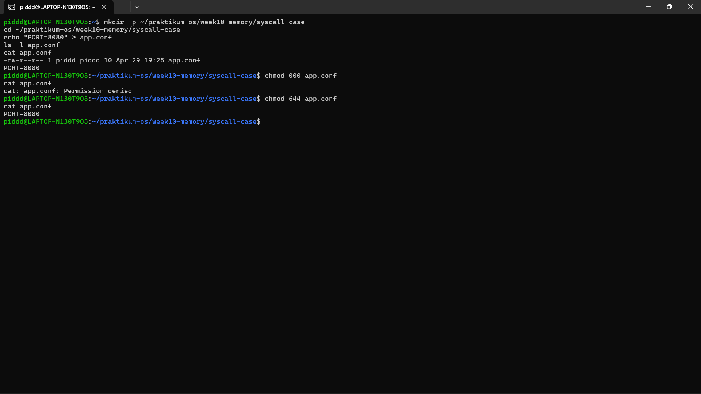
- Analisis:
1. Mengapa cat menghasilkan Permission denied setelah chmod 000? System call apa yang gagal?
2. Apa perbedaan pesan error Permission denied vs No such file or directory? Coba rm app.conf lalu cat app.conf untuk melihat perbedaannya.
3. Permission 644 berarti apa untuk owner, group, dan others?
- **Jawab:**
1. Perintah `cat` menghasilkan *Permission denied* karena hak akses file telah dikunci total dengan perintah `chmod 000` (tidak ada izin baca maupun tulis untuk siapa pun). *System call* yang gagal menembus kernel pada momen ini adalah **`openat`**.
2. Pesan **"Permission denied"** menandakan bahwa berkas tersebut fisik/lokasinya ada di dalam direktori, namun sistem operasi menolak tindakan pengguna karena benturan hak akses. Sedangkan **"No such file or directory"** menandakan lokasi atau berkas tersebut memang benar-benar fiktif dan tidak ada di dalam *storage*.
3. Permission **644** berarti:
   * **Owner/Pemilik:** Memiliki izin untuk Membaca (Read) dan Menulis (Write) `(rw-)`
   * **Group:** Hanya memiliki izin untuk Membaca `(r--)`
   * **Others/Orang Lain:** Hanya memiliki izin untuk Membaca `(r--)`

### Praktikum 10.6 Mengamati System Call dengan strace
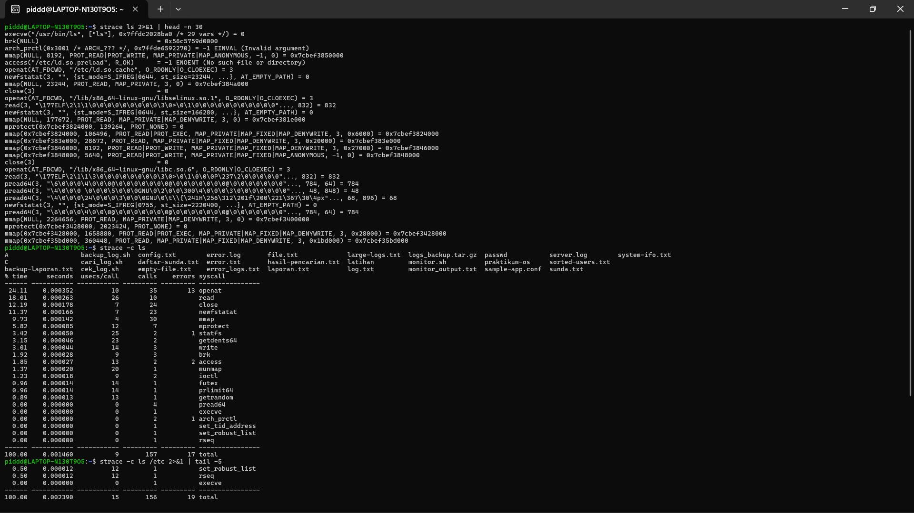
- Analisis:
1. Dari output Langkah 1, identifikasi minimal 4 system call berbeda. Jelaskan fungsi singkat masing-masing berdasarkan argumen yang terlihat.
2. Dari ringkasan strace -c, system call mana yang paling sering dipanggil? Mengapa?
3. Apakah ada system call dengan errors lebih dari 0? Apakah itu berarti program bermasalah, ataukah bagian normal dari logika program?
4. Apakah jumlah system call berbeda antara ls dan ls /etc? Faktor apa yang menyebabkan perbedaan tersebut?
- **Jawab:**
1. Empat *system call* berbeda dari output dan fungsinya:
   * **`openat`**: Meminta kernel untuk membuka dan memberi akses pada suatu file/direktori.
   * **`mmap`**: Memetakan struktur file secara langsung ke dalam area memori virtual untuk akses yang lebih cepat.
   * **`read` / `pread64`**: Membaca *byte* dan mengekstraksi data dari lokasi memori sebuah *file descriptor* yang telah terbuka.
   * **`close`**: Mengakhiri proses baca/tulis dan melepas referensi file dari kernel.
2. Berdasarkan ringkasan `strace -c`, *system call* yang paling sering dipanggil adalah **`openat`** (sebanyak 35 kali). Ini terjadi karena `ls` di lingkungan Linux tidak hanya membaca isi direktori target saja, melainkan harus membuka banyak konfigurasi bahasa lokal, zona waktu, hingga memuat file *library* dinamis milik sistem (seperti ekstensi `.so`) agar format teks bisa ditampilkan ke pengguna.
3. Ya, terdapat **17 error** (seperti 13 pada `openat` dan 2 pada `access`). Hal ini **bukan berarti program bermasalah**. Error semacam *ENOENT* sangat normal dari logika dasar program pencarian; `ls` berturut-turut mengecek ketersediaan beberapa direktori *library* menggunakan `access` / `openat`. Jika gagal di satu jalur, ia memunculkan *error internal*, lalu wajar saja berpindah mencoba membaca jalur (*path*) alternatif lainnya hingga sukses tanpa menghentikan aplikasinya.
4. Ya, jumlah total panggilannya berbeda (`ls` biasa memakan 155 panggilan, sedangkan `ls /etc` memakan 156 panggilan). Faktor yang menyebabkannya adalah kompleksitas dari isi masing-masing direktori; `/etc` berisi lebih banyak tumpukan format berkas ketimbang sebuah folder pengguna yang kosong.

## 1.6 Tugas Praktikum
### Tugas 10.1 Audit Penggunaan Memori Sistem
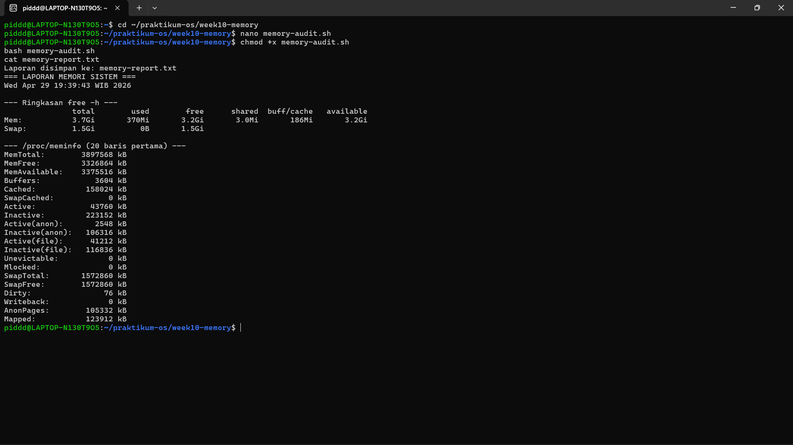
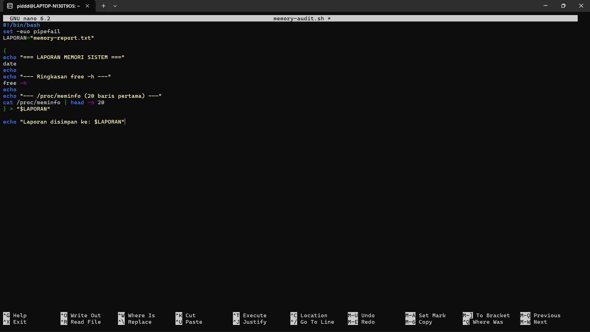
- Analisis
1. Hitung persentase memori tersedia (available / total × 100%). Apakah sistem dalam kondisi normal?
2. Mengapa buff/cache tidak dihitung sebagai memori yang terpakai dari sudutpandang ketersediaan untuk aplikasi?
3. Dari /proc/meminfo, apakah SwapTotal lebih besar dari 0? Berapa nilai SwapFree?

- Jawab
1. Berdasarkan data dari `/proc/meminfo`, `MemAvailable` adalah 3375516 kB dan `MemTotal` adalah 3897568 kB. Jika dihitung persentasenya: (3375516 / 3897568) × 100% = **86,6%**. Dengan ketersediaan memori sebesar 86,6%, sistem dalam kondisi **sangat normal**.
2. Memori `buff/cache` tidak dihitung sebagai memori terpakai dari sudut pandang ketersediaan karena kernel Linux mengelola area ini secara dinamis dan akan langsung membebaskan cache tersebut secara otomatis jika ada aplikasi baru yang membutuhkan ruang memori.
3. Ya, dari output `/proc/meminfo`, nilai **SwapTotal** lebih besar dari 0, yaitu sebesar **1572860 kB**. Sementara itu, nilai **SwapFree** juga sebesar **1572860 kB**, yang menandakan swap tersedia penuh dan belum terpakai sama sekali.

### Tugas 10.2 Identifikasi Proses dengan Memori Tertinggi
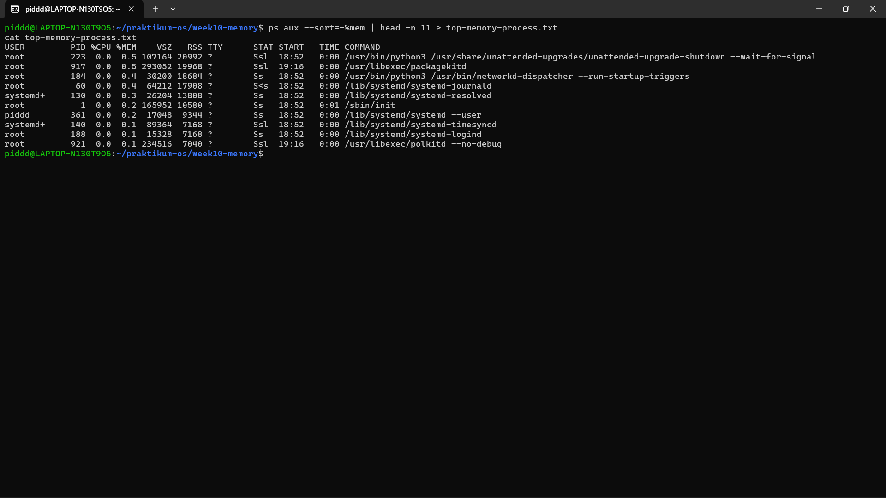
- Analisis
1. Proses apa di urutan pertama? Catat nilai %MEM dan RSS.
2. Konversikan RSS ke MB (bagi 1024). Apakah wajar?
3. Jumlahkan %MEM dari 5 proses teratas. Berapa persen RAM yang mereka gunakan bersama?

- Jawab
1. Berdasarkan output `ps aux`, proses di urutan pertama adalah `/usr/bin/python3 /usr/share/unattended-upgrades/unattended-upgrade-shutdown --wait-for-signal` dengan nilai **%MEM** sebesar **0.5** dan **RSS** sebesar **20992**.
2. Jika nilai `RSS` dikonversikan ke MB (20992 / 1024), hasilnya adalah **20,5 MB**. Penggunaan memori sebesar ini sangat **wajar** untuk sebuah proses sistem (skrip Python) yang berjalan di latar belakang.
3. Total persentase RAM yang digunakan oleh 5 proses teratas secara bersamaan adalah **2,1%** (0.5 + 0.5 + 0.4 + 0.4 + 0.3).

### Tugas 10.3 Membuat dan Memverifikasi Swap File
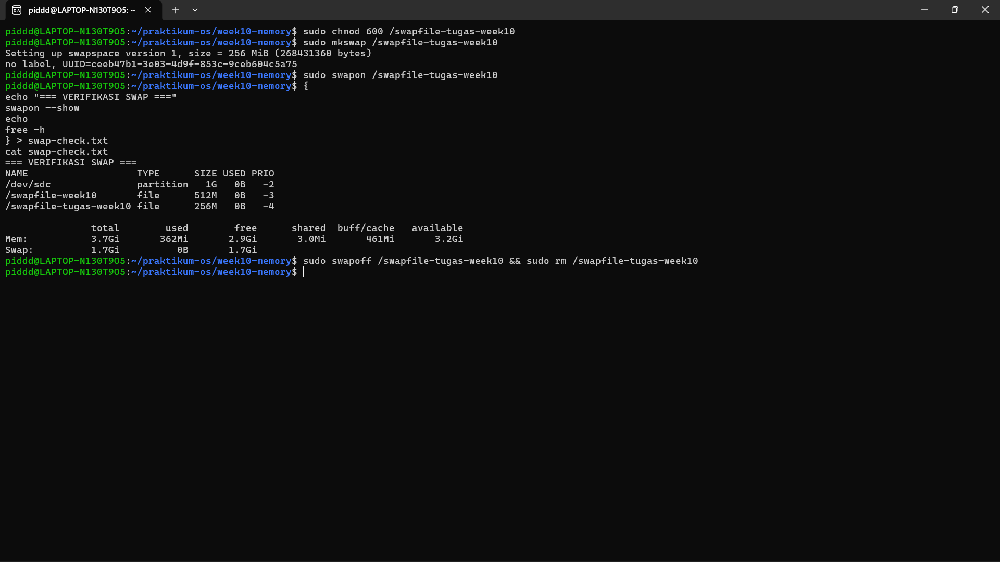
- Analisis
1. Identifikasi kolom NAME, TYPE, SIZE, dan USED pada output swapon –show.
2. Apakah nilai total pada baris Swap di free -h bertambah 256 MB?
3. Mengapa permission 600 penting? Apa risiko jika diatur ke 644?

- Jawab
1. Dari output `swapon --show`, teridentifikasi: 
   * **NAME:** `/swapfile-tugas-week10` 
   * **TYPE:** `file` 
   * **SIZE:** `256M` 
   * **USED:** `0B`
2. Ya, nilai total pada baris Swap di perintah `free -h` telah bertambah. Terlihat kapasitas total swap naik menjadi **1.7Gi** (sebelumnya 1.5Gi pada tugas 10.1).
3. Izin akses (*permission*) `600` sangat penting agar hanya pengguna `root` yang dapat membaca dan menulis file tersebut. Risikonya jika diatur ke `644` (izin terbuka), pengguna biasa bisa mengekstrak dan membaca isi dari file swap tersebut, yang mana bisa saja berisi data sensitif (*password*, sesi login) yang sedang dipindahkan dari RAM.

### Tugas 10.4 Analisis System Call dengan strace
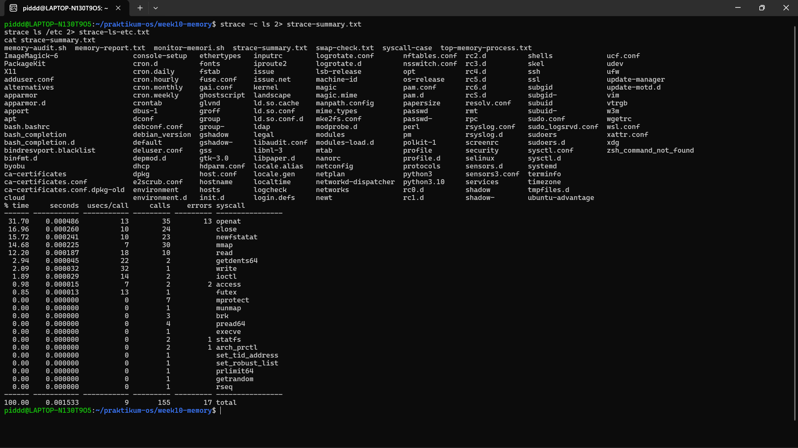
- Analisis
1. Sebutkan minimal 5 system call dari strace-summary.txt beserta fungsi singkatnya.
2. System call mana yang paling sering dipanggil? Mengapa?
3. Apakah ada errors lebih dari 0? Apakah program tetap berjalan normal meskipun ada kegagalan tersebut?

- Jawab
1. Lima *system call* dari `strace-summary.txt` beserta fungsinya:
   * **`openat`**: Membuka file atau direktori.
   * **`close`**: Menutup file *descriptor* yang sebelumnya dibuka.
   * **`newfstatat`**: Membaca informasi/metadata dari suatu file.
   * **`mmap`**: Memetakan file atau *device* ke dalam ruang memori.
   * **`read`**: Membaca isi data dari suatu *file descriptor*.
2. *System call* yang paling sering dipanggil adalah **`openat`** (35 kali panggilan). Hal ini karena perintah `ls` perlu membuka dan mengecek banyak lokasi file konfigurasi dan *library* pendukung terlebih dahulu sebelum bisa memuat direktori yang dituju.
3. Ya, terdapat total **17 errors** (seperti error pada `openat` dan `access`). Meskipun ada kegagalan ini, program tetap berjalan normal karena error tersebut (*file not found* / `ENOENT`) adalah bagian wajar saat program mencoba mencari konfigurasi di berbagai lokasi alternatif secara berurutan.

### Tugas 10.5 Studi Kasus Diagnosa Server Lambat
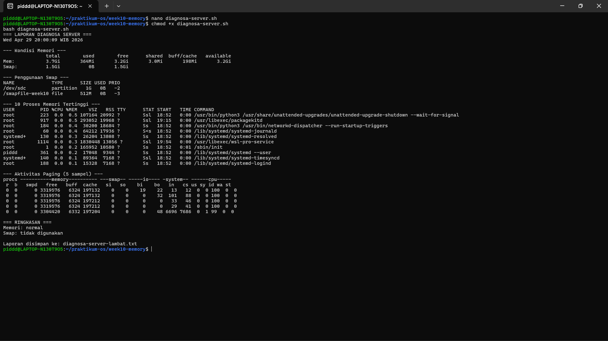
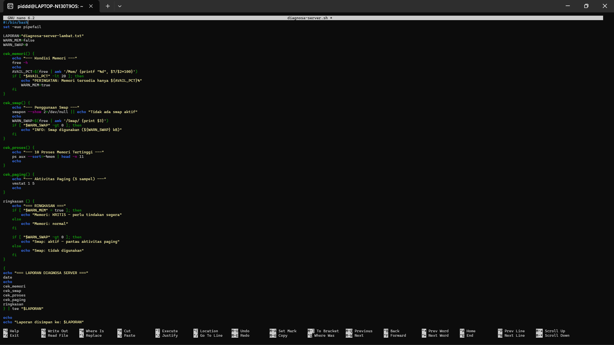
- Analisis
1. Jelaskan peran masing-masing fungsi: cek_memori, cek_swap, cek_proses, cek_paging, dan ringkasan. Mengapa diagnosa dipecah menjadi fungsi terpisah?
2. Berdasarkan bagian RINGKASAN, apakah kondisi sistem normal atau kritis? Jelaskan berdasarkan nilai threshold yang digunakan script.
3. Mengapa script menggunakan tee "$LAPORAN" bukan redirection biasa > "$LAPORAN"? Apa keuntungannya?
4. Dari output cek_paging, apakah ada aktivitas si atau so? Jika ada, apa implikasinya terhadap performa server?

- Jawab
1. Peran fungsinya: 
   * `cek_memori`: memantau sisa RAM.
   * `cek_swap`: mengecek status memori virtual.
   * `cek_proses`: menampilkan 10 proses yang memakan banyak memori.
   * `cek_paging`: memantau aktivitas perpindahan memori secara *real-time*.
   * `ringkasan`: memberikan kesimpulan akhir. 
   
   Diagnosa dipecah menjadi fungsi terpisah agar kode (*script*) lebih rapi, terstruktur, dan lebih mudah dilacak jika ada kesalahan (*debugging*).
2. Berdasarkan bagian RINGKASAN, sistem dalam kondisi **normal** dan memori berstatus aman. Hal ini karena persentase memori yang tersedia jauh di atas *threshold* krisis yang ditetapkan oleh *script* (yaitu peringatan akan muncul jika memori di bawah 20%).
3. Penggunaan perintah `tee` memungkinkan output ditampilkan di layar terminal sekaligus direkam ke dalam file laporan di saat yang bersamaan. Jika menggunakan `>` (*redirection* biasa), layar terminal tidak akan menampilkan apa-apa karena semua output langsung dibelokkan ke dalam file secara senyap.
4. Tidak, dari output *paging* (`vmstat`), nilai pada kolom `si` (*swap in*) dan `so` (*swap out*) semuanya menunjukkan angka **0**. Jika seandainya ada aktivitas di sana (nilainya lebih dari 0 terus-menerus), performa server akan sangat lambat dan berpotensi *hang* karena sistem harus membaca dan menulis data dari disk yang kecepatannya jauh lebih lambat dibanding RAM.

