# Laporan Praktikum Sistem Operasi Jobsheet 11
<h4> Nama   : Ahmad Rafid Riqkullah <h4>
<h4> NIM    : 254107020078 <h4>
<h4> Kelas  : TI-1G <h4>

# 1 Manajemen File & User/Group
## 1.1 Sistem Kontrol Akses (Permissions)
### Praktikum 9.1 — Permissions
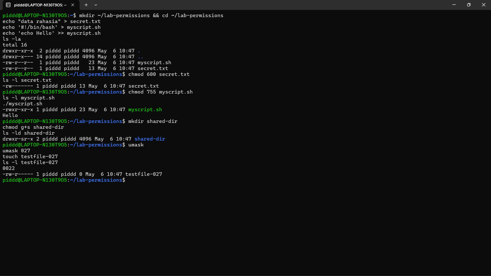
- Analisis
1. Mengapa secret.txt tidak dapat dibaca oleh group dan others setelah chmod 600?
2. Apa perbedaan arti 600 dan 755 terhadap file yang diuji?
3. Setelah umask 027, permission apa yang dihasilkan untuk file baru, dan mengapa bukan 777?
- **Jawab:**
1. secret.txt tidak dapat dibaca oleh group dan others karena perintah chmod 600 mengubah permission menjadi rw-------. Artinya, hanya owner (pemilik) yang memiliki izin read dan write, sedangkan group dan others diatur menjadi 0 (tidak ada akses sama sekali).
2. Perbedaan 600 dan 755:
    * 600 (rw-------): Hanya owner yang bisa membaca dan mengubah file. Tidak ada yang bisa mengeksekusi. File bersifat sangat privat.
    * 755 (rwxr-xr-x): Owner memiliki hak penuh (baca, tulis, eksekusi), sedangkan group dan others hanya memiliki hak untuk membaca dan mengeksekusi file, tetapi tidak bisa mengubah isinya.
3. Setelah umask 027, permission yang dihasilkan untuk file baru adalah 640 (-rw-r-----). Tidak menjadi 777 karena di Linux, sistem tidak pernah memberikan izin eksekusi (x) secara otomatis pada file reguler demi alasan keamanan. Nilai awal default untuk file adalah 666, sehingga perhitungannya menjadi 666 - 027 = 640.

- Tantangan
Ubah owner atau group salah satu file uji ke akun atau group lain yang tersedia di sistem, kemudian jelaskan perubahan output ls -l sebelum dan sesudahnya.
- **Jawab:**
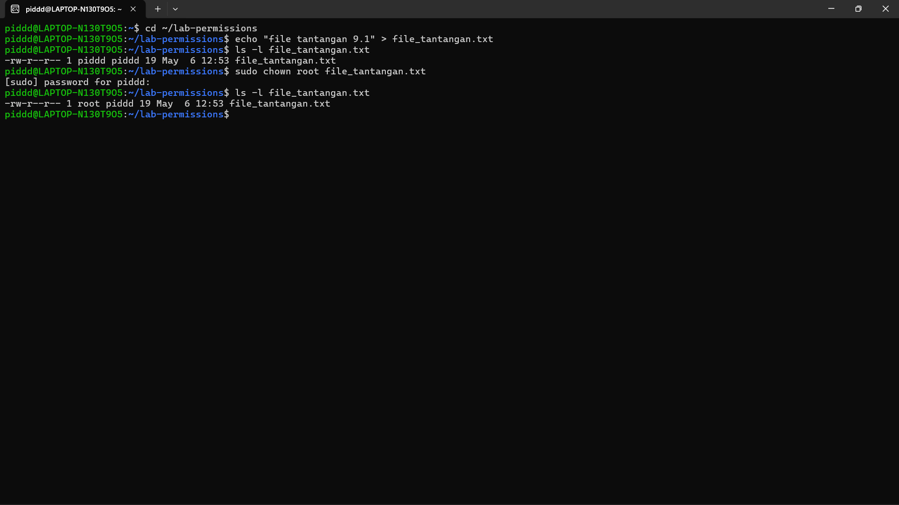

## 1.2 Access Control Lists (ACLs)
### Praktikum 9.2 — ACL
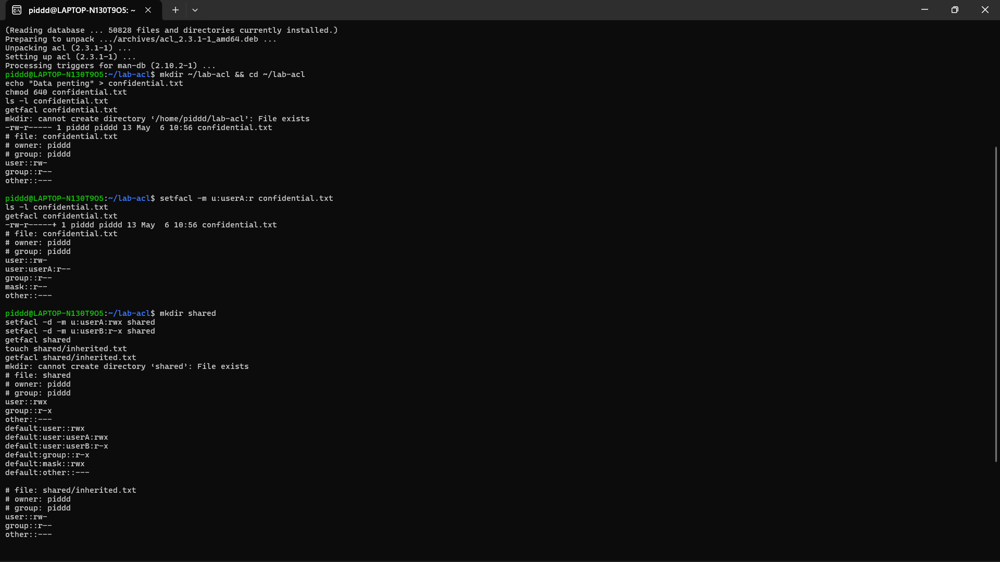
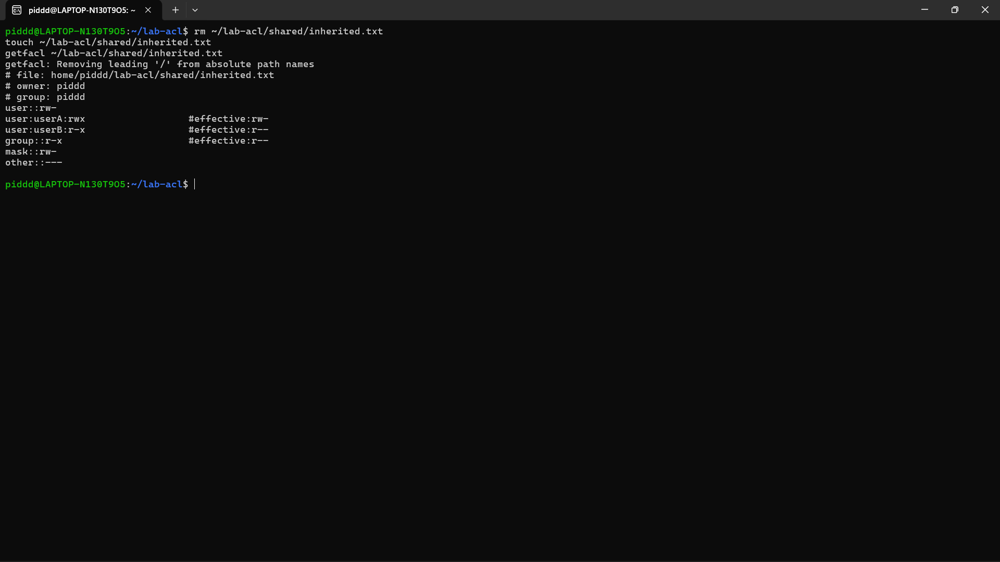
- Analisis
1. Mengapa getfacl confidential.txt awalnya tidak menampilkan user tertentu?
2. Setelah setfacl -m u:userA:r confidential.txt, apa perbedaan output ls -l dan getfacl?
3. Mengapa file inherited.txt mewarisi ACL dari direktori shared?
- **Jawab:**
1. Perintah getfacl confidential.txt awalnya tidak menampilkan user tertentu karena file tersebut belum memiliki aturan ACL tambahan. Sistem hanya menampilkan tiga entri dasar yang sepadan dengan permission standar Unix (owner, group, dan others).
2. Setelah setfacl -m u:userA:r confidential.txt:
    * Output ls -l menambahkan tanda + di akhir string permission (menjadi -rw-r-----+), menandakan bahwa file tersebut dilindungi oleh aturan ACL.
    * Output getfacl kini menampilkan entri baru secara spesifik yaitu user:userA:r-- beserta entri mask.
3. File inherited.txt mewarisi ACL karena direktori induknya (shared) telah dikonfigurasi dengan Default ACL menggunakan opsi -d (setfacl -d -m ...). Aturan default ini otomatis diturunkan ke setiap file dan direktori baru yang dibuat di dalamnya.

- Tantangan
Tambahkan satu ACL lagi agar group readonly-group hanya dapat membaca confidential.txt. Setelah itu, hapus ACL untuk userA dan verifikasi hasil akhirnya dengan getfacl.
- **Jawab:**
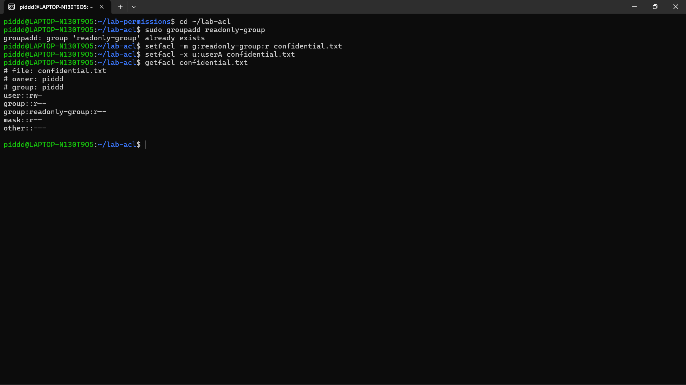

## 1.3 Manajemen User dan Group
### Praktikum 9.3A — Membuat dan Mengelola User
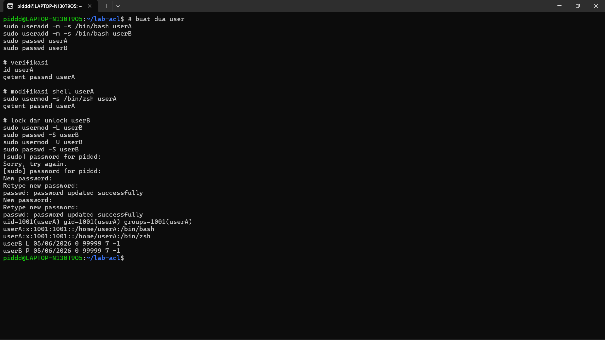
- Pertanyaan:
1. Apa perbedaan output id userA sebelum dan sesudah menambah group?
2. Bagaimana status passwd -S userB berubah saat akun di-lock?
- **Jawab:**
1. Sebelum ditambahkan, output id userA hanya menampilkan primary group dari user tersebut. Setelah perintah usermod -aG dijalankan (di praktikum 9.3B), bagian groups= pada output akan menampilkan daftar tambahan supplementary group yang baru dimasukkan (seperti labgroup dan readonly-group).
2. Status pada output passwd -S userB akan memunculkan huruf L (singkatan dari Locked) tepat setelah nama user (contoh: userB L 05/06/2026 ...). Ini menandakan bahwa password akun tersebut sedang dikunci.

### Praktikum 9.3B — Group Management
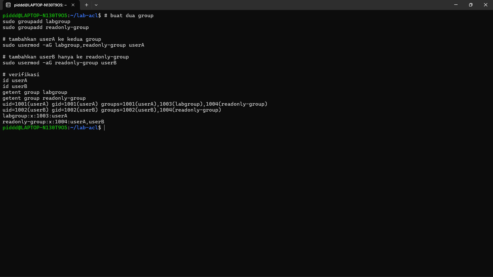
- Pertanyaan:
1. Apa yang ditampilkan id userA vs groups userA?
2. Mengapa -a pada usermod -aG penting?
- **Jawab:**
1. id userA menampilkan informasi identitas secara lengkap dan detail, meliputi UID, GID primary, beserta seluruh nama dan nomor ID supplementary groups. Sedangkan groups userA hanya menampilkan nama-nama grup yang dianggotai oleh user tersebut secara sederhana.
2. Opsi -a (berarti append atau menambahkan) pada usermod -aG sangat penting karena ia akan menambahkan user ke grup baru tanpa menghapusnya dari grup-grup lama. Jika hanya menggunakan -G tanpa -a, user akan dimasukkan ke grup baru tetapi dikeluarkan dari semua supplementary group sebelumnya.

### Praktikum 9.3C — Password Aging Policy
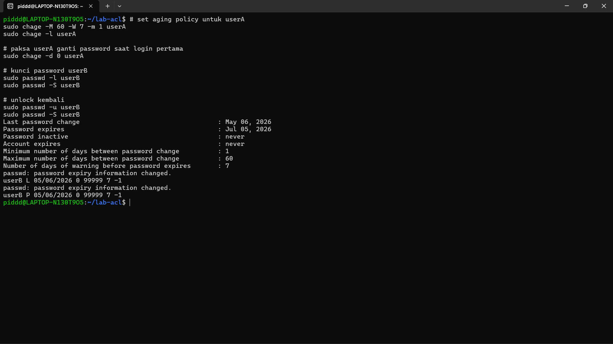
- Pertanyaan:
1. Apa arti nilai yang ditampilkan chage -l userA?
2. Bagaimana cara membuktikan userB terkunci dari output passwd -S?
3. Kapan sebaiknya menggunakan chage -d 0 vs passwd -e?
- **Jawab:**
1. Nilai yang ditampilkan chage -l userA adalah rincian kebijakan umur password (Aging Policy) untuk userA. Itu meliputi tanggal password terakhir diubah, kapan akan kedaluwarsa (misal 60 hari ke depan), jarak hari minimum untuk bisa ganti password, dan sisa hari peringatan (7 hari) sebelum password benar-benar kedaluwarsa.
2. Bisa dibuktikan dari output passwd -S userB yang memiliki karakter L (Locked) setelah username, yang berarti akun tidak bisa digunakan untuk login menggunakan password.
3. chage -d 0 dan passwd -e memiliki fungsi yang sama persis, yaitu memaksa user mengganti password pada login berikutnya (dengan menyetel tanggal last password change ke 0). Keduanya bisa digunakan kapan saja sesuai preferensi administrator, namun chage biasanya dipakai saat ingin mengatur kebijakan umur password lainnya secara bersamaan.

- Tantangan
Buat user bernama intern yang:
• memiliki shell /bin/bash;
• menjadi anggota labgroup;
• dipaksa ganti password pada login pertama;
• password expired setelah 45 hari dengan warning 7 hari sebelumnya.
- **Jawab:**
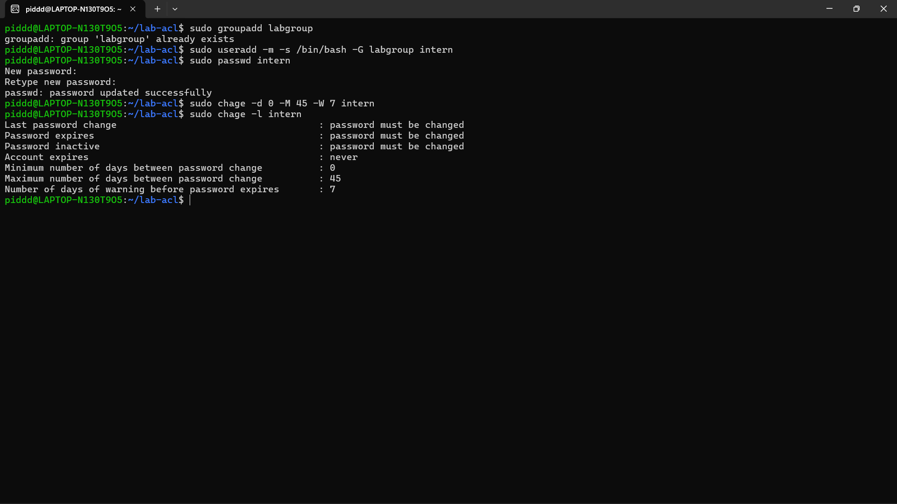

## 1.4 Konfigurasi sudo dan su
### Praktikum 9.4 — Konfigurasi sudo
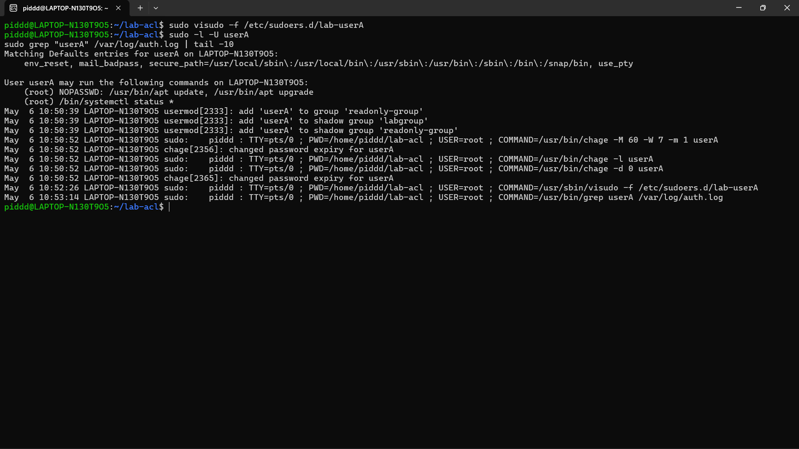
- Analisis
1. Mengapa aturan disimpan di /etc/sudoers.d//, bukan langsung di /etc/sudoers?
2. Mana perintah yang bisa dijalankan tanpa password, dan mana yang masih perlu autentikasi?
3. Informasi apa saja yang dicatat di log sudo?
- **Jawab:**
1. Aturan disimpan di /etc/sudoers.d/ untuk memisahkan konfigurasi secara modular. Ini lebih aman karena mencegah file utama /etc/sudoers rusak akibat kesalahan sintaks, lebih rapi untuk mengelola banyak user, dan memastikan aturan kustom tidak tertimpa saat paket sudo melakukan update.
2. Perintah /usr/bin/apt update dan /usr/bin/apt upgrade bisa dijalankan tanpa password karena terdapat parameter NOPASSWD:. Sedangkan /bin/systemctl status * tetap membutuhkan autentikasi karena tidak menggunakan parameter tersebut.
3. Log di /var/log/auth.log mencatat siapa user asli yang menjalankan perintah (piddd), terminal yang digunakan (TTY), direktori kerja (PWD), user target peralihan hak asuh (USER=root), serta perintah spesifik yang dieksekusi (COMMAND).

- Tantangan
Tambahkan satu aturan baru agar userA boleh menjalankan /bin/systemctl restart ssh tetapi tidak boleh menjalankan reboot.
- **Jawab:**
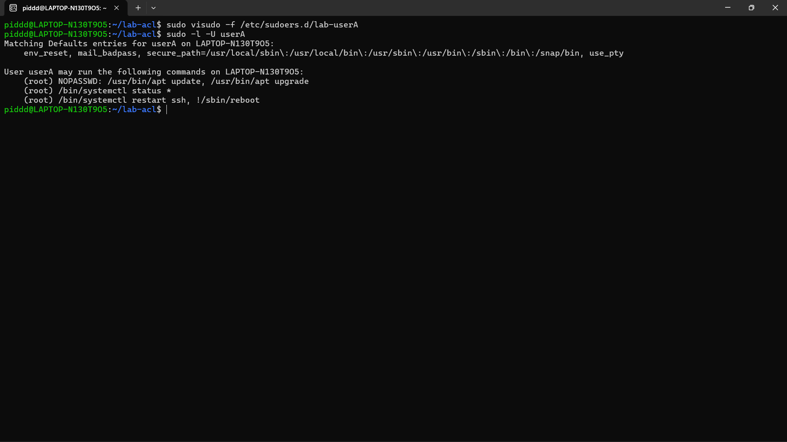

## 1.5 Disk Quota
### Praktikum 9.5 — Disk Quota
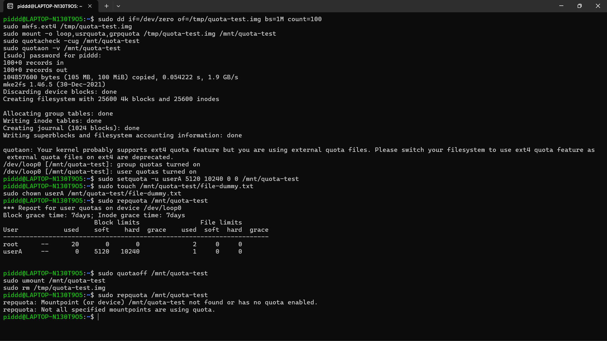
- Analisis
1. Apa perbedaan soft limit dan hard limit saat quota mulai terlampaui?
2. Mengapa praktikum ini memakai loopback filesystem, bukan langsung /home/?
3. Dari output repquota, informasi apa yang menunjukkan quota sudah aktif?
- **Jawab:**
1. Soft limit adalah batas peringatan yang masih boleh dilampaui sementara waktu (selama grace period belum habis). Sedangkan Hard limit adalah batas maksimal mutlak; sistem akan langsung menolak penulisan data begitu batas ini disentuh.
2. Menggunakan loopback filesystem (/tmp/quota-test.img) adalah cara yang paling aman untuk sarana uji coba (sandbox). Jika terjadi kesalahan konfigurasi, filesystem utama komputer (/home/) tidak akan terdampak atau rusak.
3. Indikator kuota sudah aktif pada output repquota adalah tampilnya tabel limit blok, limit file (inode), grace period, serta munculnya daftar user (seperti root dan userA) beserta angka penggunaan storage-nya masing-masing. Di atas tabel juga tertulis Report for user quotas on device....

- Tantangan
Coba atur quota baru untuk userA dengan batas inode yang sangat kecil, kemudian jelaskan kapan pembatasan inode lebih penting daripada pembatasan block.
- **Jawab:**
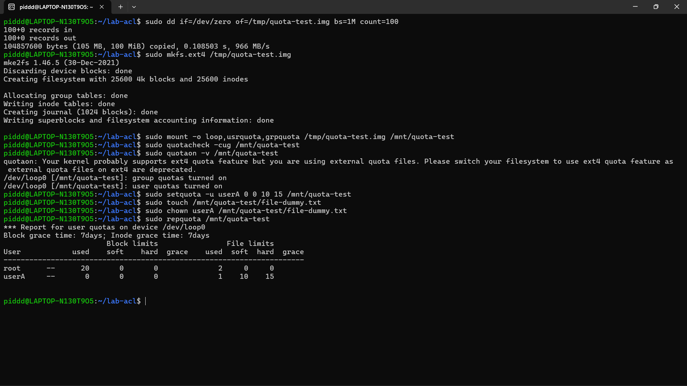

## 1.7 Latihan
### Latihan Latihan 9.A — Audit dan Kolaborasi

1. Temukan file SUID aktif dengan find / -perm -4000 -type f 2>/dev/null, lalu jelaskan tiga file yang Anda kenali beserta alasannya.
2. Cari direktori world-writable dan tentukan mana yang valid dan mana yang berisiko.
3. Rancang konfigurasi permission standar dan ACL untuk direktori proyek /srv/webapp/ agar group webapp-team dapat menulis, user deploy hanya membaca, dan file baru selalu mewarisi group proyek.
- **Jawab:**

### Latihan Latihan 9.B — Kebijakan Akun dan Quota
- Tuliskan langkah untuk membuat user intern, menambahkannya ke group labgroup, memaksa pergantian password tiap 45 hari (warning 7 hari), memberi izin sudo hanya untuk systemctl status, dan menetapkan quota ruang serta inode sederhana pada /home/.
- **Jawab:**
