# Laporan Praktikum Sistem Operasi Jobsheet 12
<h4> Nama  : Ahmad Rafid Riqkullah <h4>
<h4> NIM   : 254107020078 <h4>
<h4> Kelas : TI-1G <h4>

# 1 Manajemen Service
## 1.1 Pengenalan systemd
### Praktikum 10.1 — Amati Layanan Aktif Saat Boot
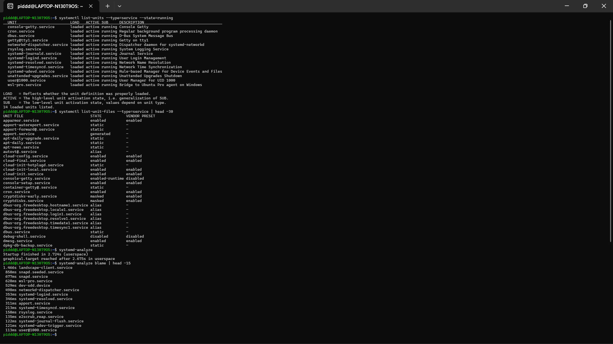
- Tantangan
Identifikasi tiga layanan dengan waktu inisialisasi terlama menggunakan `systemd-analyze blame`. Gunakan pipeline `sort -rh | head -3`. Untuk setiap layanan, cari tahu fungsinya dengan `systemctl cat nama-layanan`.
- **Jawab:**
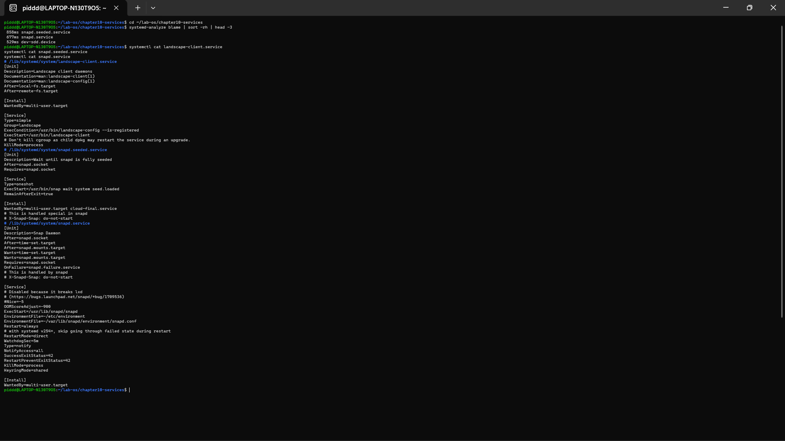

---

## 1.2 Mengelola Layanan dengan systemctl
### Praktikum 10.2 — Kelola Layanan SSH
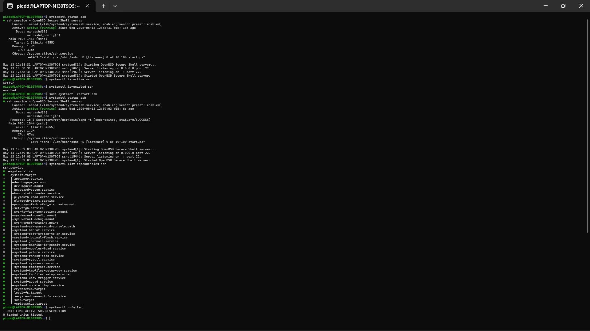
- Tantangan
Buat skrip Bash bernama `cek-layanan.sh` yang memeriksa status daftar layanan dari sebuah berkas teks. Berkas teks `daftar-layanan.txt` berisi satu nama layanan per baris (minimal: ssh, cron, rsyslog). Skrip memeriksa statusnya dengan `systemctl is-active`, lalu menulis laporan ke berkas `laporan-layanan.log` dengan format: `[TANGGAL] nama-layanan: ACTIVE/INACTIVE`.
- **Jawab:**
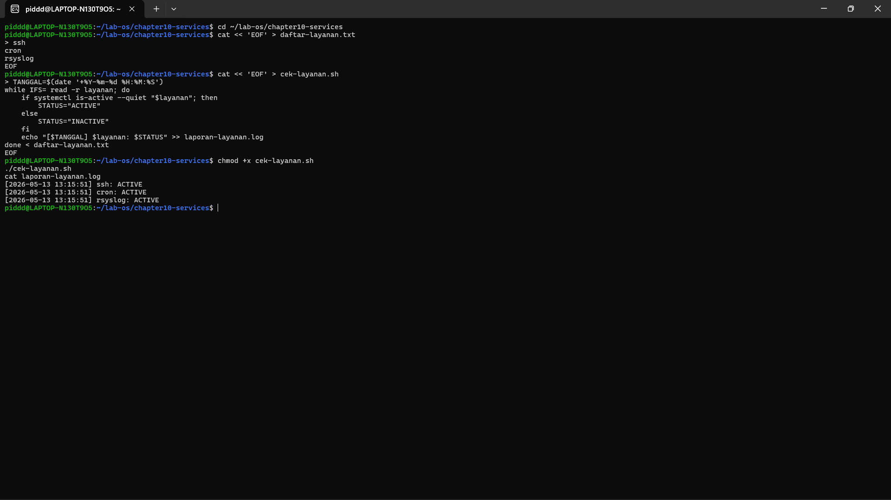

---

## 1.3 Membuat Berkas Unit Kustom
### Praktikum 10.3 — Buat Layanan Sederhana dari Skrip Bash
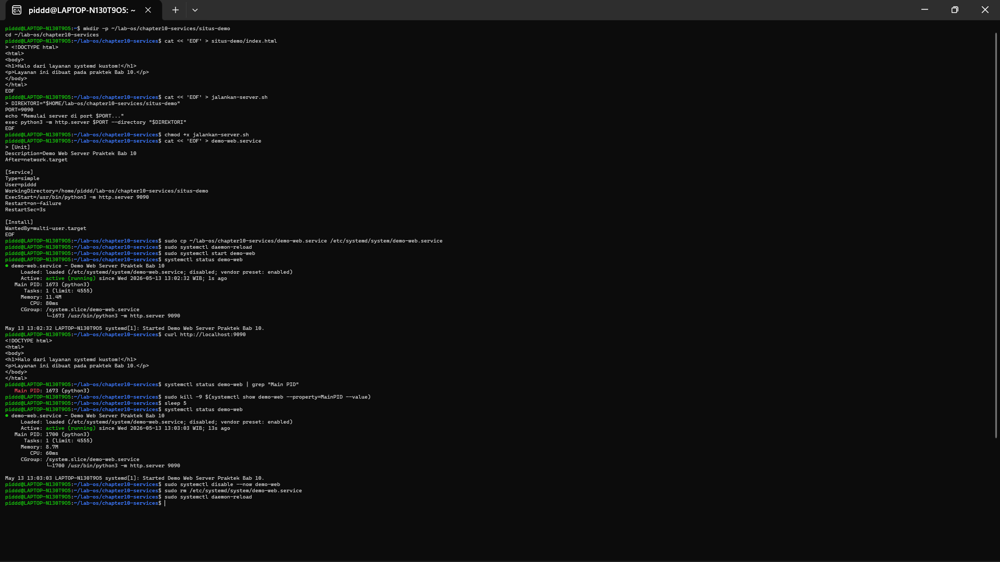
- Tantangan
Modifikasi berkas unit `demo-web.service`: tambahkan `RestartSec=10s` agar sistem menunggu 10 detik sebelum mencoba restart, tambahkan `Environment="PORT=9091"`, lalu ubah `ExecStart` agar menggunakan variabel tersebut. Uji perubahannya.
- **Jawab:**
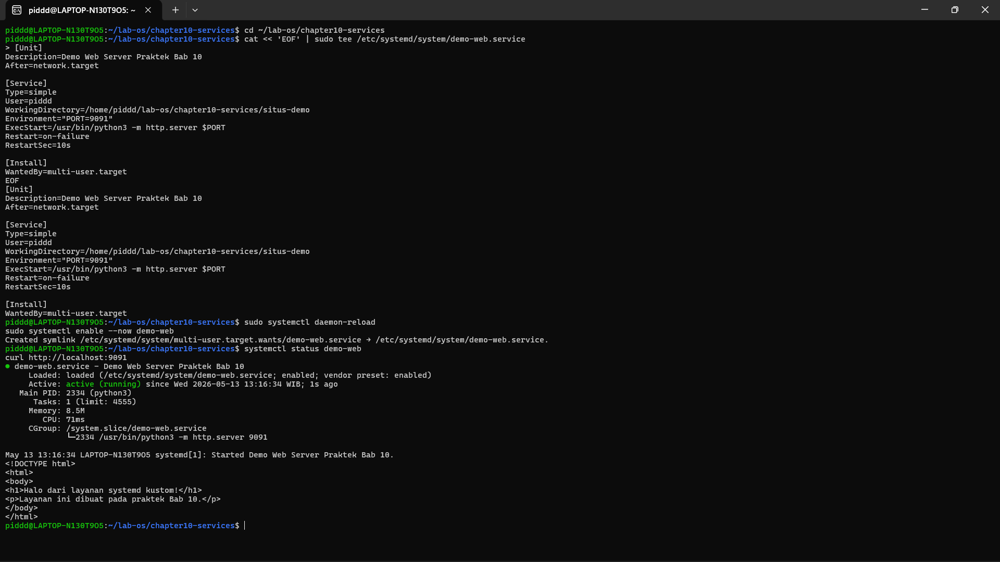

---

## 1.4 Logging dengan journalctl
### Praktikum 10.4 — Filter dan Analisis Log Layanan
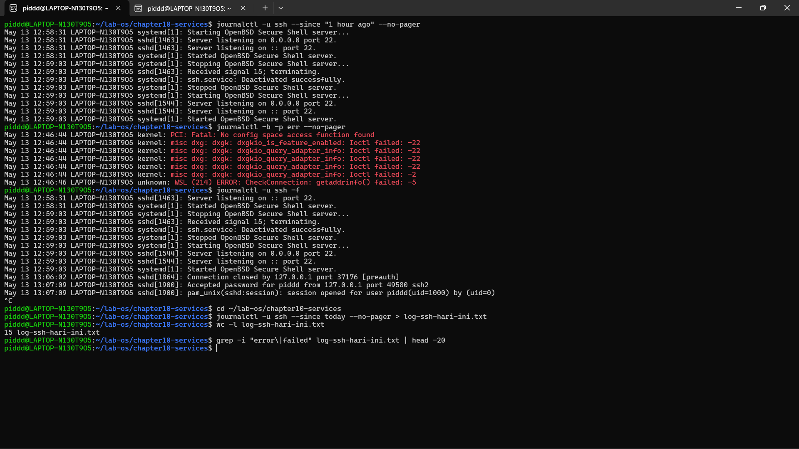
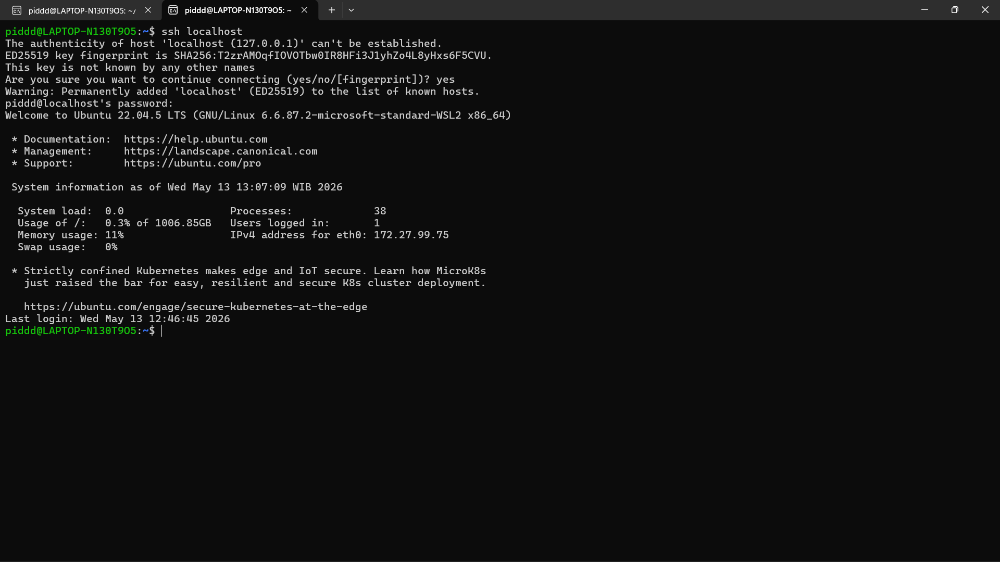
- Tantangan
Ekstrak semua log dengan prioritas error (`-p err`) dari 24 jam terakhir untuk layanan SSH, simpan ke berkas `error-ssh-24jam.txt`. Hitung total jumlah baris error dengan `wc -l`, lalu tampilkan 10 pesan error yang paling sering muncul menggunakan `sort | uniq -c | sort -rn | head -10`.
- **Jawab:**
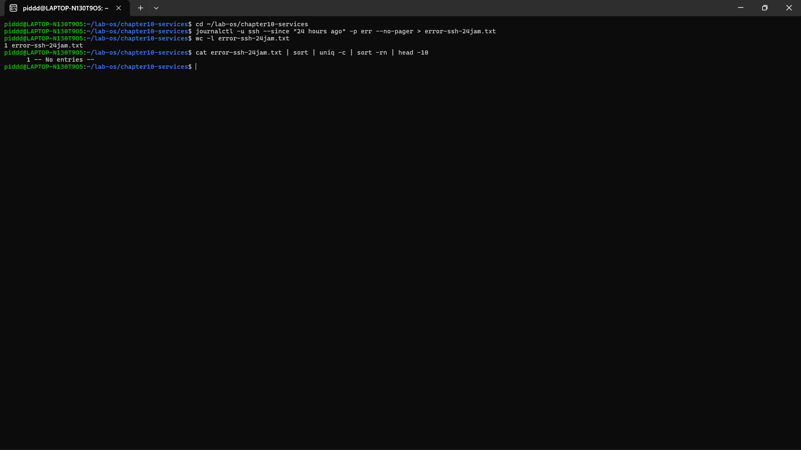

---

## 1.5 Konfigurasi Layanan Jaringan
### Praktikum 10.5 — Konfigurasi SSH Server
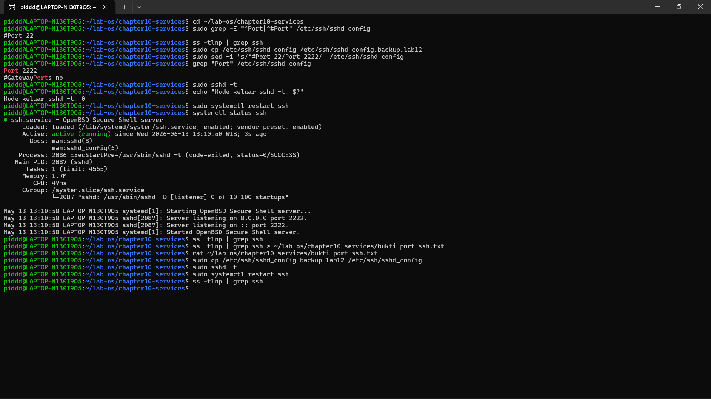
- Tantangan
Ubah konfigurasi SSH untuk menambahkan dua pengaturan keamanan: `PermitRootLogin no` dan `MaxAuthTries 3`. Lakukan urutan aman: backup, edit, validasi `sshd -t`, dan reload.
- **Jawab:**
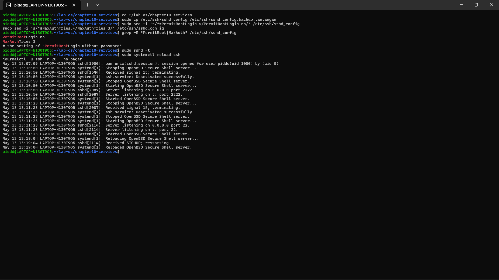

---

## 1.7 Latihan
### Latihan 10.1 — Audit Layanan dan Analisis Boot
1. Jalankan systemctl list-units –type=service –state=running dan catat semua layanan aktif. Pilih tiga layanan yang kamu kenal, periksa status masing-masing dengan systemctl status, dan jelaskan fungsinya.
2. Jalankan systemd-analyze blame dan identifikasi lima layanan dengan waktu inisialisasi terlama. Tampilkan hasilnya menggunakan pipeline: systemd-analyze blame | head -5.
3. Jalankan systemctl –failed dan dokumentasikan hasilnya. Jika ada layanan yang gagal, cari tahu penyebabnya dengan journalctl -u nama-layanan -n 30.
- **Jawab:**
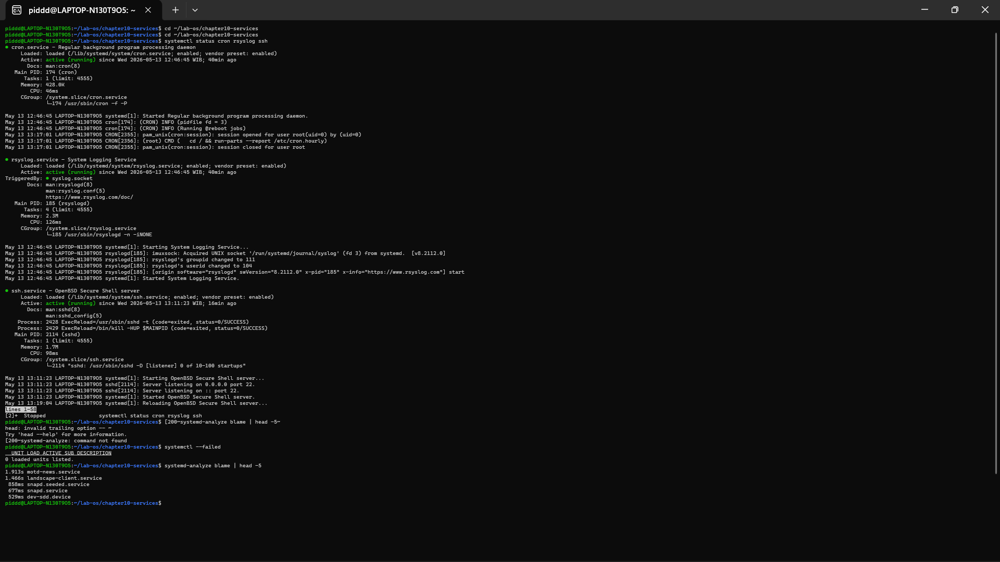
- Penjelasan:
    * cron: Layanan sistem yang bertugas untuk menjalankan perintah atau skrip secara otomatis pada waktu yang sudah dijadwalkan (seperti alarm otomatis untuk server).
    * rsyslog: Layanan yang berfungsi sebagai "buku catatan" sistem. Ia mengumpulkan dan mencatat semua log atau pesan aktivitas yang terjadi di dalam Ubuntu.
    * ssh: Layanan yang memungkinkan administrator untuk masuk dan mengontrol server dari jarak jauh melalui jaringan dengan enkripsi yang aman.

Perintah systemd-analyze blame sangat berguna untuk mengaudit performa booting karena menampilkan layanan mana saja yang paling memakan waktu saat sistem menyala. Adapun output 0 loaded units pada perintah systemctl --failed menandakan bahwa Ubuntu kita sangat sehat dan tidak ada layanan yang crash atau gagal dimuat.

---

### Latihan 10.2 — Layanan Kustom dengan Restart Otomatis
1. Buat skrip Bash (referensi Bab 7) bernama monitor-disk.sh yang setiap 30 detik menuliskan penggunaan disk ke berkas log. Gunakan df -h dan date.
2. Buat berkas unit /etc/systemd/system/monitor-disk.service untuk menjalankan skrip tersebut dengan konfigurasi: Restart=always, RestartSec=5s, dan berjalan sebagai pengguna kamu sendiri.
3. Aktifkan dan jalankan layanan. Verifikasi dengan systemctl status dan pastikan log masuk ke journal.
4. Simulasikan crash dengan membunuh proses secara paksa (kill -9), tunggu 10 detik, dan verifikasi bahwa layanan hidup kembali secara otomatis.
5. Bersihkan: nonaktifkan layanan dan hapus berkas unit setelah selesai.
- **Jawab:**
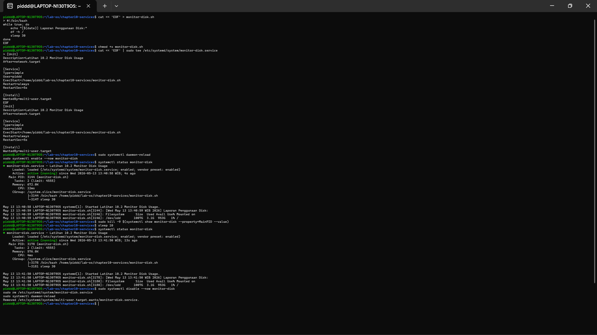
- Pada latihan ini, kita berhasil membuat layanan (service) kustom bernama monitor-disk yang berjalan di latar belakang untuk mencatat penggunaan disk. Kunci utamanya ada pada konfigurasi Restart=always dan RestartSec=5s di dalam berkas unit. Dengan aturan ini, systemd bertindak sebagai pengawas; ketika proses layanan tersebut mati mendadak (yang kita simulasikan dengan perintah kill -9), sistem secara otomatis akan menghidupkannya kembali dalam waktu jeda 5 detik. Hal ini sangat penting di dunia nyata agar aplikasi tetap terus menyala meskipun sempat terjadi error.

---

### Latihan 10.3 — Investigasi Log dan Keamanan SSH
1. Gunakan journalctl -b -p err untuk menemukan semua error sejak boot terakhir. Simpan hasilnya ke berkas dan hitung jumlah baris dengan wc -l.
2. Lakukan tiga perubahan keamanan pada /etc/ssh/sshd_config: tambahkan PermitRootLogin no, MaxAuthTries 3, dan LoginGraceTime 30. Ikuti alur aman: backup, edit, validasi sshd -t, reload.
3. Setelah reload, verifikasi tiga hal: layanan masih berjalan (systemctl status ssh), port masih mendengarkan (ss -tlnp | grep ssh), dan konfigurasi baru terbaca (grep -E "PermitRoot|MaxAuth|GraceTime" /etc/ssh/sshd_config).
4. Kembalikan konfigurasi SSH ke kondisi semula menggunakan berkas backup.
- **Jawab:**
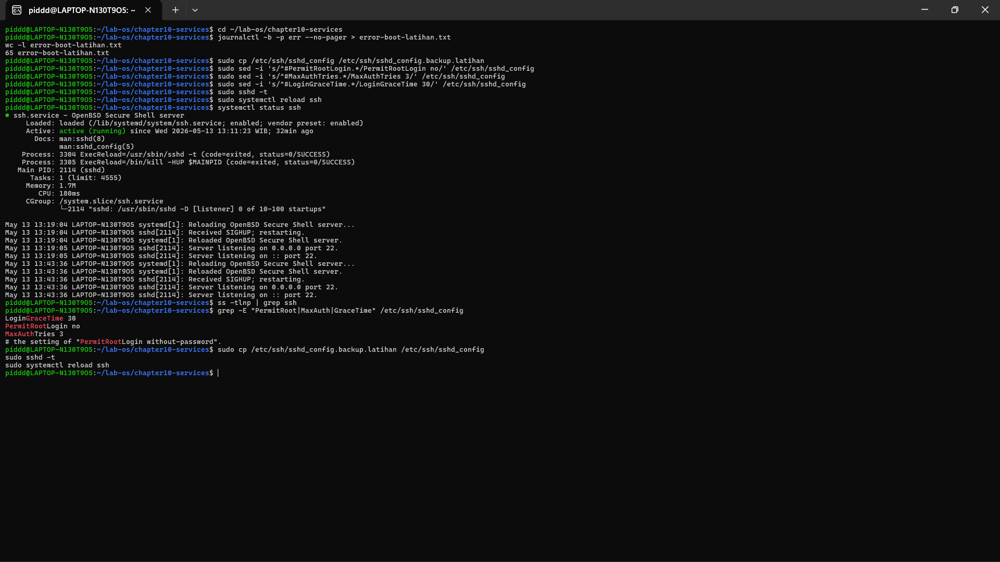
- Pada latihan ini, kita melakukan hardening (pengerasan keamanan) pada layanan SSH. Aturan PermitRootLogin no mencegah peretas untuk mencoba login langsung menggunakan akun administrator tertinggi (root). Kemudian MaxAuthTries 3 membatasi percobaan password gagal maksimal 3 kali untuk mencegah serangan brute-force. Praktik ini juga mengajarkan alur kerja yang aman bagi seorang SysAdmin: yaitu selalu memvalidasi sintaks konfigurasi menggunakan perintah sshd -t sebelum me-reload layanan. Jika langkah validasi ini dilewati dan ternyata ada salah ketik di konfigurasi, layanan SSH bisa mati dan kita akan terkunci dari server kita sendiri.