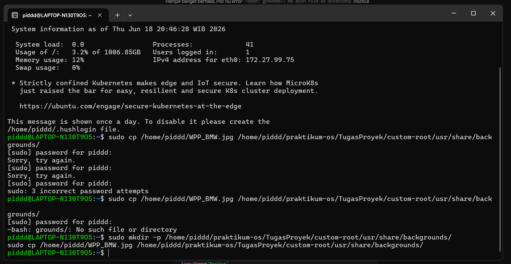
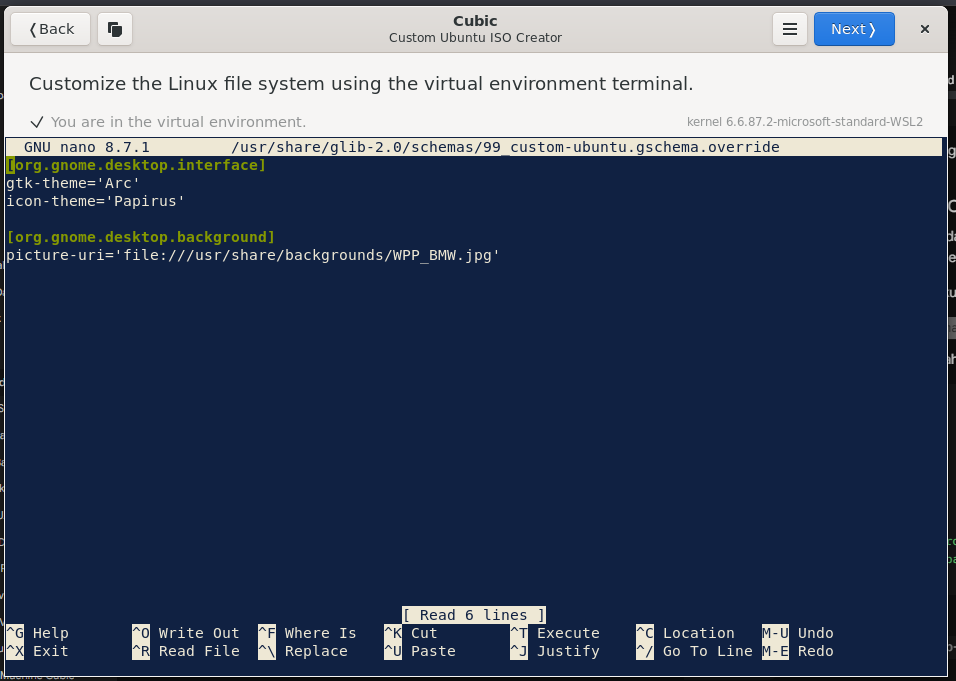
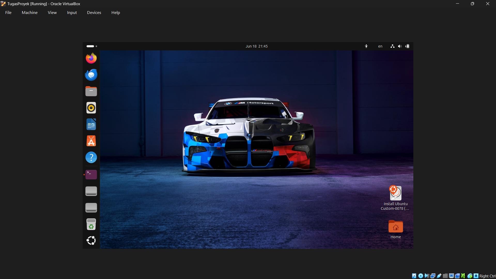
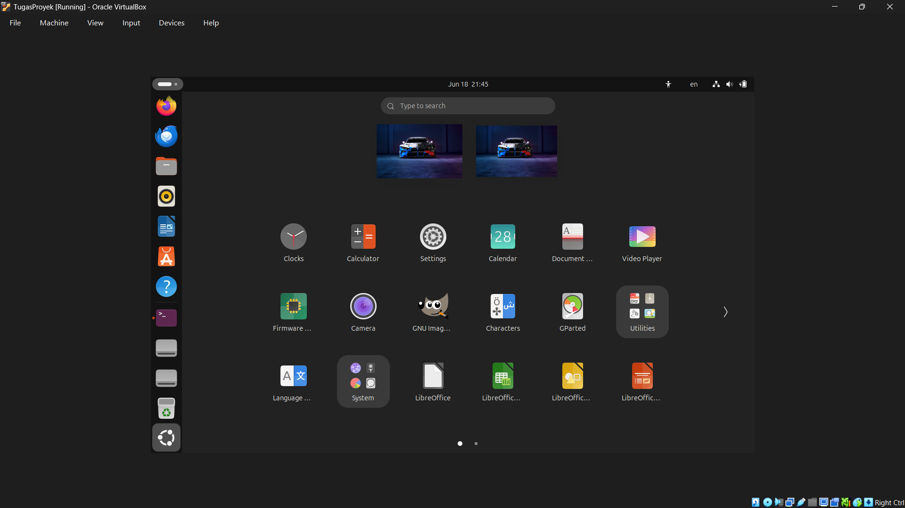
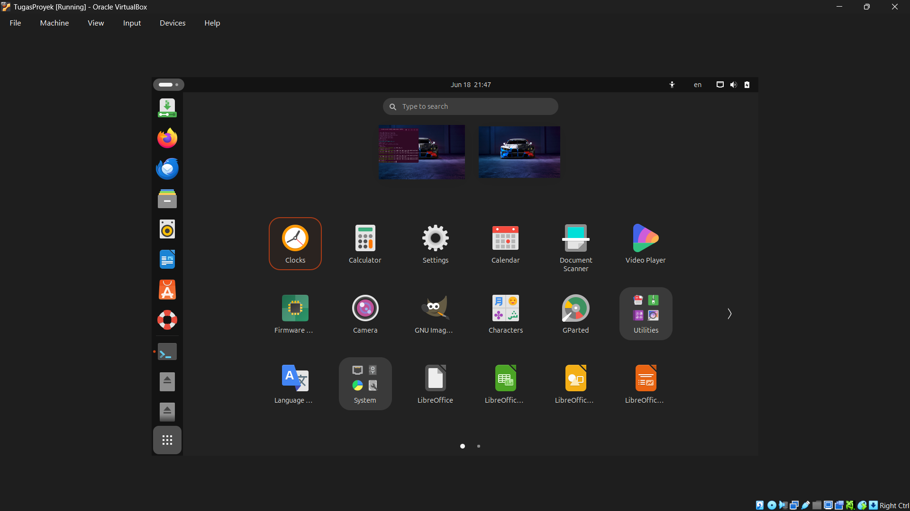
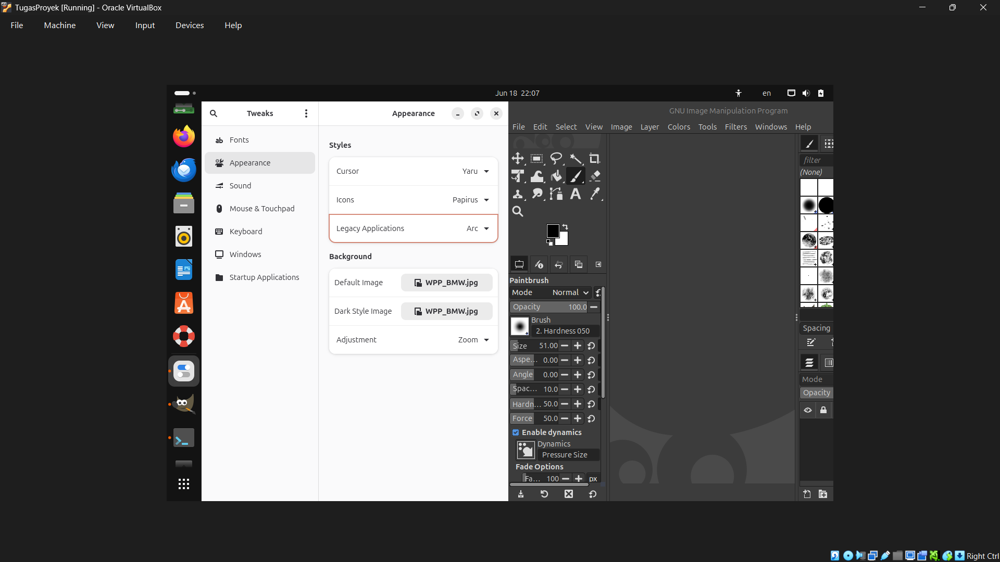
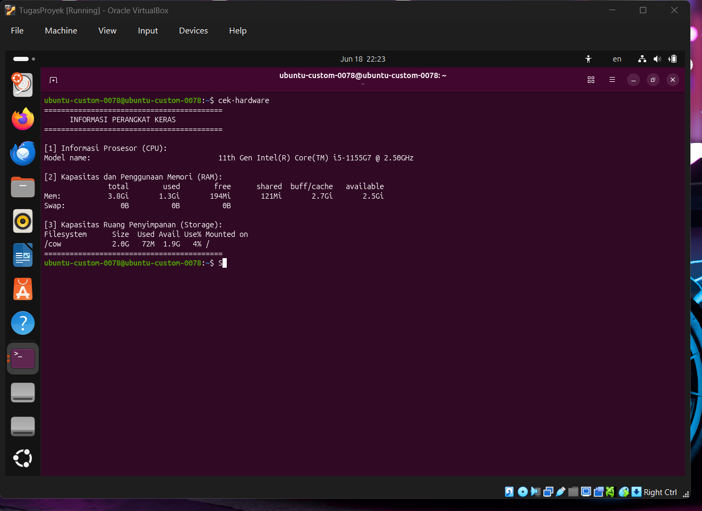

# Laporan tugas proyek
<h4> Nama  : Ahmad Rafid Riqkullah <h4>
<h4> NIM   : 254107020078 <h4>
<h4> Kelas : TI-1G <h4>

# Laporan Praktikum Proyek Sistem Operasi

1. Persiapan Sistem Dasar
Hasil: Berhasil menyiapkan file ISO Ubuntu 26.04 dan mengonfigurasi Cubic sebagai tool remastering.

**Penjelasan:** Proses ini meliputi pengunduhan file ISO Ubuntu 26.04 asli, instalasi perangkat lunak Cubic (Custom Ubuntu ISO Creator) pada sistem *host*, dan keberhasilan memuat file ISO tersebut ke dalam lingkungan terminal chroot Cubic untuk memulai proses *remastering*.

2. Kustomisasi dan Instalasi Aplikasi
Hasil: Berhasil menginstal VLC, GIMP, Apache2, PHP, VS Code, dan script bash `cek-hardware` di dalam sistem.

**Penjelasan:** Gambar di atas menunjukkan verifikasi instalasi paket perangkat lunak pihak ketiga (seperti VLC, GIMP, Apache2, PHP, dan VS Code) melalui terminal Cubic untuk memastikan semua aplikasi telah terpasang dengan baik pada sistem.

**Penjelasan:** Pengujian *script bash* `cek-hardware` dilakukan secara langsung di dalam virtual terminal Cubic sebelum proses *build* ISO. Hal ini membuktikan bahwa *script* sudah berfungsi normal dan dapat menampilkan informasi *hardware* dengan benar.

3. Kustomisasi Tampilan

**Penjelasan:** Langkah ini mendemonstrasikan proses pemindahan file gambar *wallpaper* kustom ke dalam folder `/usr/share/backgrounds/` pada sistem ISO. Selain itu, dilakukan juga instalasi aplikasi GNOME Tweaks untuk mempermudah pengaturan dan transisi tema visual secara langsung lewat antarmuka grafis jika sewaktu-waktu dibutuhkan.

**Penjelasan:** Pembuatan file konfigurasi `.gschema` dilakukan di terminal Cubic untuk menanamkan modifikasi secara permanen, dengan detail sebagai berikut:
* **Tema Sistem:** Menetapkan `gtk-theme` menjadi 'Arc' untuk merombak gaya jendela aplikasi.
* **Tema Ikon:** Mengubah `icon-theme` menggunakan paket 'Papirus' yang sudah terinstal.
* **Wallpaper Terang:** Menggunakan parameter `picture-uri` untuk mengatur *wallpaper* yang akan aktif saat sistem berada di mode tampilan standar (terang).
* **Wallpaper Gelap:** Menambahkan parameter `picture-uri-dark` untuk memastikan *wallpaper* mobil tetap muncul ketika sistem berjalan di mode gelap.

4. Pembuatan File ISO Baru
Hasil: Proses build berhasil dengan nama file Ubuntu-Custom-254107020078.iso.

**Penjelasan:** Sistem memulai tahapan *generate* atau pengemasan ulang semua modifikasi yang dilakukan di dalam Cubic untuk dijadikan satu format file sistem *bootable* yang baru.

**Penjelasan:** Notifikasi *build successful* dari Cubic yang menandakan bahwa file ISO kustomisasi dengan nama `Ubuntu-Custom-254107020078.iso` telah berhasil dicetak dan siap diuji coba.

5. Pengujian dan Dokumentasi
Hasil: Sistem berhasil di-booting di VirtualBox. Berhasil mengambil screenshot tampilan desktop dan output script bash.

**Penjelasan:** Menampilkan *wallpaper default* Ubuntu (bawaan pabrik) sebelum modifikasi ISO diterapkan.

**Penjelasan:** Tampilan *desktop* setelah menggunakan file ISO *remastering*, memperlihatkan *wallpaper* yang berhasil terganti secara otomatis menggunakan gambar kustom pilihan.

**Penjelasan:** Bentuk visual awal dari kumpulan ikon aplikasi pada panel samping Ubuntu dengan menggunakan tema standar Yaru.

**Penjelasan:** Visual panel aplikasi yang berubah drastis setelah menerapkan desain dari tema ikon Papirus.

**Penjelasan:** Penerapan tema sistem Arc berhasil diimplementasikan. Meskipun perubahannya tampak samar (*subtle*) di antarmuka luar, terdapat modifikasi yang jelas pada desain jendela bergaya *flat* (datar), perubahan warna sorotan (aksen), dan bentuk tombol jendela yang lebih minimalis dibandingkan bawaan Ubuntu.

**Penjelasan:** Dokumentasi keberhasilan eksekusi *script bash* `cek-hardware` yang diujikan pada terminal aplikasi di dalam VirtualBox. Program dapat mencetak rincian beban CPU, alokasi memori RAM, serta kapasitas memori penyimpanan *disk* secara *real-time*.