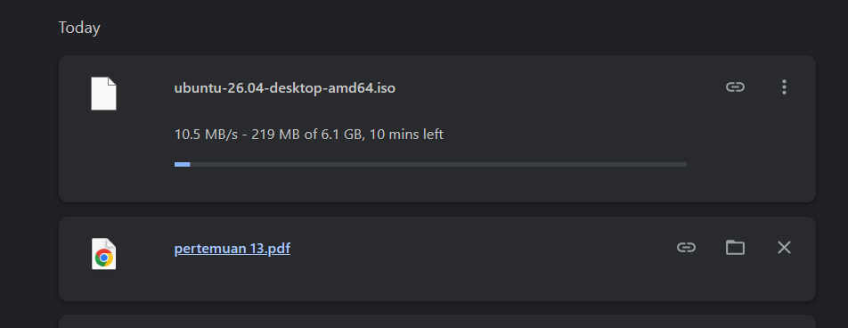
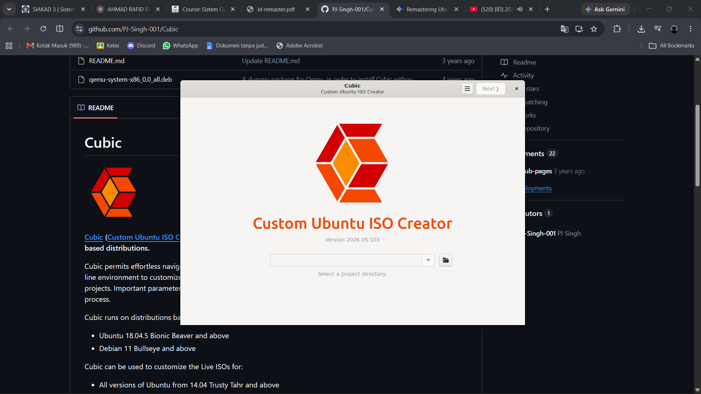
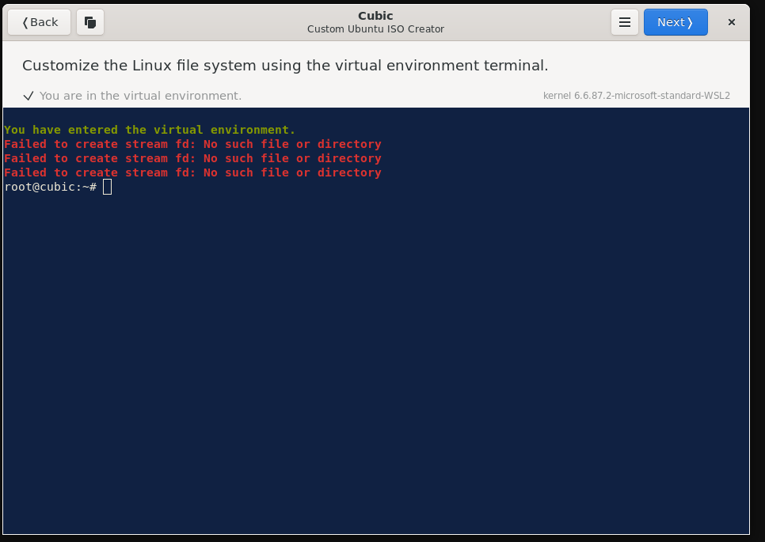
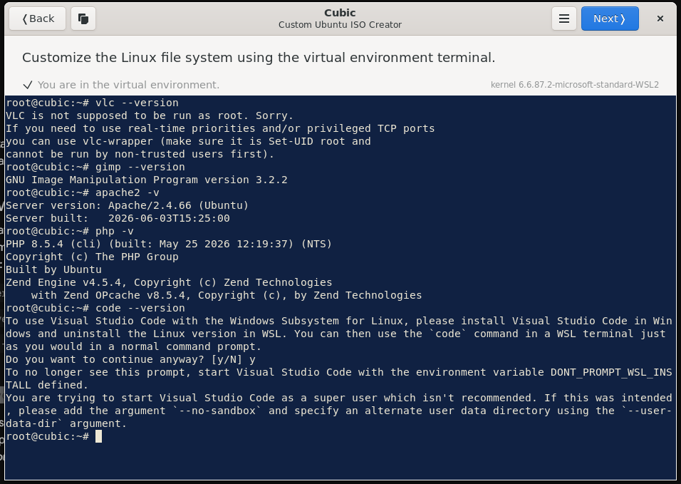
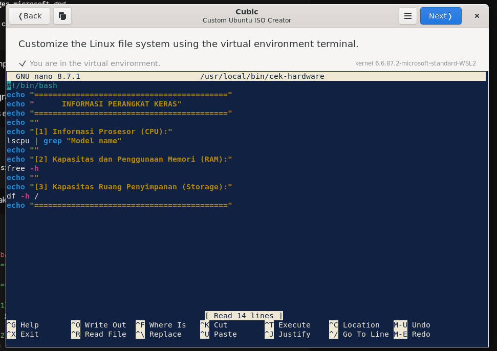
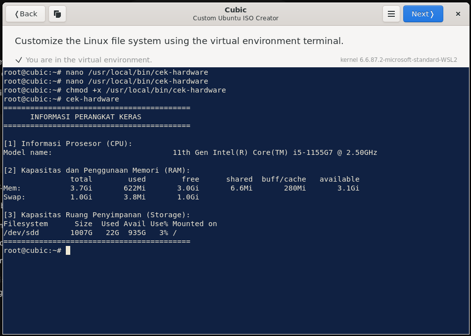
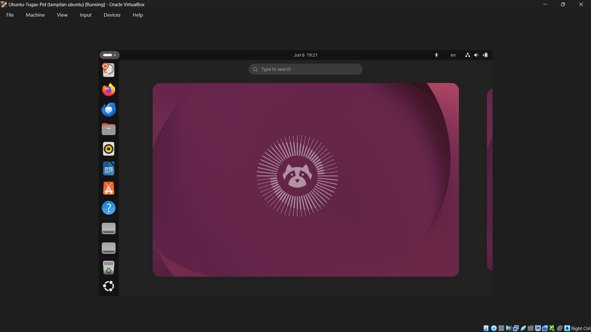
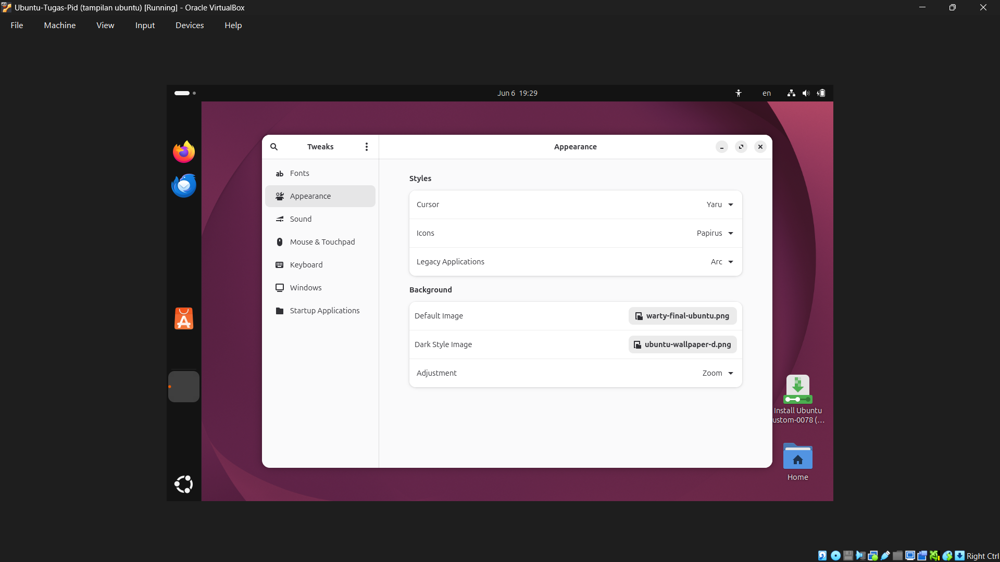
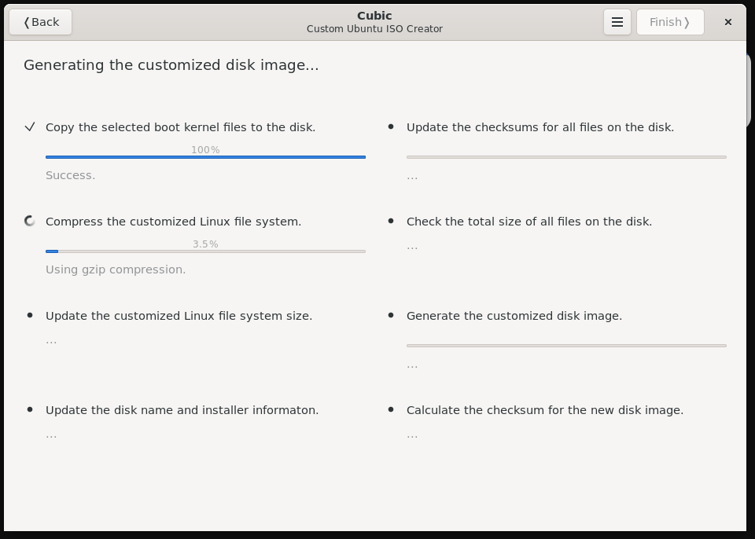
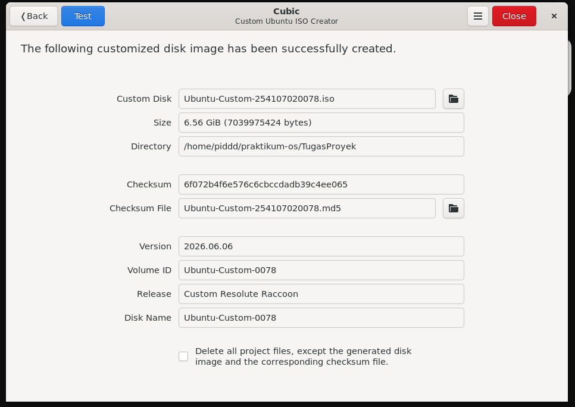

# Laporan tugas proyek
<h4> Nama  : Ahmad Rafid Riqkullah <h4>
<h4> NIM   : 254107020078 <h4>
<h4> Kelas : TI-1G <h4>

# Laporan Praktikum Proyek Sistem Operasi

1. Persiapan Sistem Dasar
Hasil: Berhasil menyiapkan file ISO Ubuntu 26.04 dan mengonfigurasi Cubic sebagai tool remastering.

2. Kustomisasi dan Instalasi Aplikasi
Hasil: Berhasil menginstal VLC, GIMP, Apache2, PHP, VS Code, dan script bash `cek-hardware` di dalam sistem.

3. Kustomisasi Tampilan
Hasil: Berhasil mengubah wallpaper mobil, menerapkan tema Arc, dan paket ikon Papirus.

4. Pembuatan File ISO Baru
Hasil: Proses build berhasil dengan nama file Ubuntu-Custom-254107020078.iso.

5. Pengujian dan Dokumentasi
Hasil: Sistem berhasil di-booting di VirtualBox. Berhasil mengambil screenshot tampilan desktop dan output script bash.

