# Laporan Praktikum Sistem Operasi Jobsheet 4

<h4> Nama   : Ahmad Rafid Riqkullah <h4>
<h4> NIM    : 254107020078 <h4>
<h4> Kelas  : TI-1G <h4>

# Operasi File dan Struktur Direktory
## Latihan
1. Cobalah urutan perintah berikut:
```
$ cd
$ pwd
$ ls -al
$ cd .
$ pwd
$ cd ..
$ pwd
$ ls -al
$ cd ..
$ pwd
$ ls -al
$ cd /etc
$ ls -al | more
$ cat passwd
$ cd -
$ pwd
```
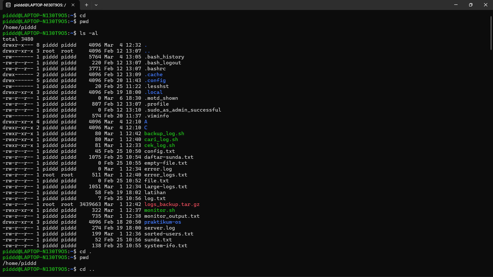
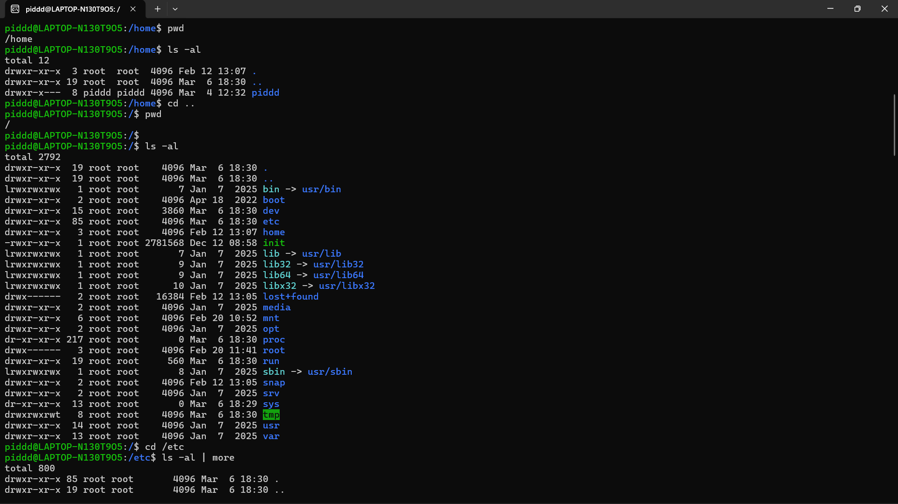
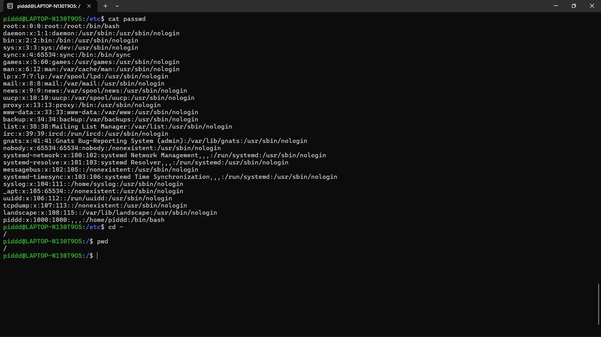

2. Lanjutkan penelusuran pohon pada sistem file menggunakan cd, ls, pwd dan cat. Telusuri direktori /bin, /usr/bin, /sbin, /tmp dan /boot.
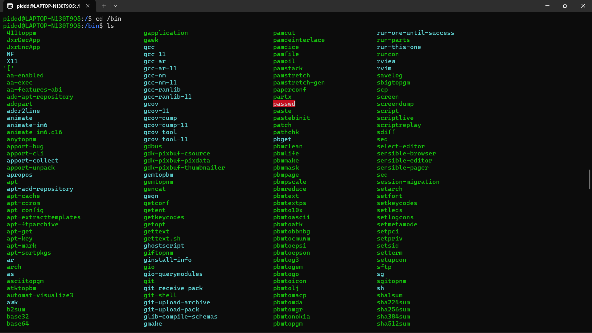
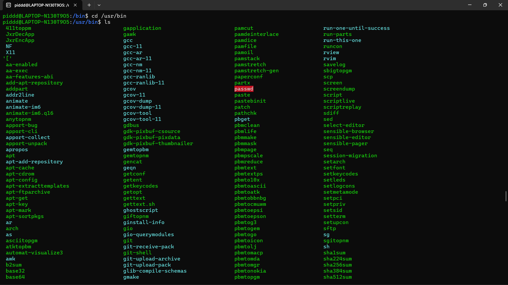
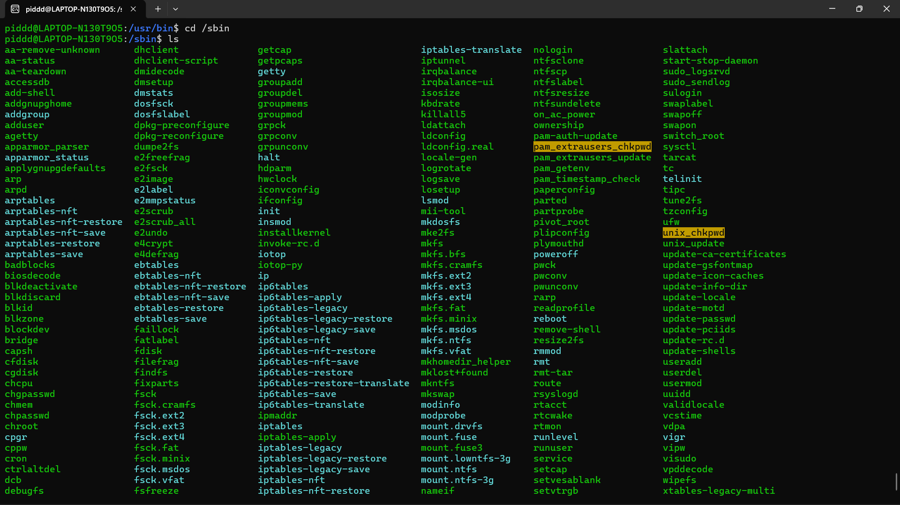
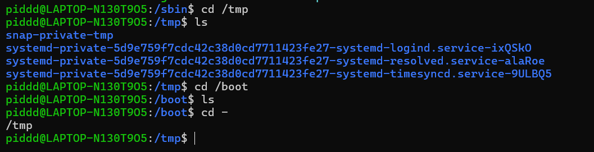

3. Telusuri direktori /dev. Identifikasi perangkat yang tersedia. Identifikasi tty (terminal) Anda (ketik who am i); siapa pemilik tty Anda (gunakan ls -l).
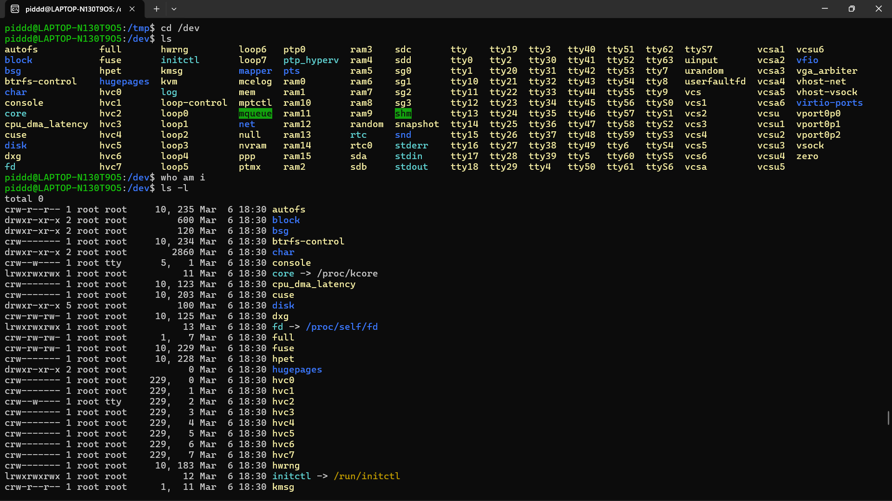

4. Telusuri directory /proc. Tampilkan isi file interrupts, devices, cpuinfo, meminfo dan uptime menggunakan perintah cat. Dapatkah Anda melihat mengapa directory /proc disebut pseudo-filesystem yang memungkinkan akses ke struktur data kernel?
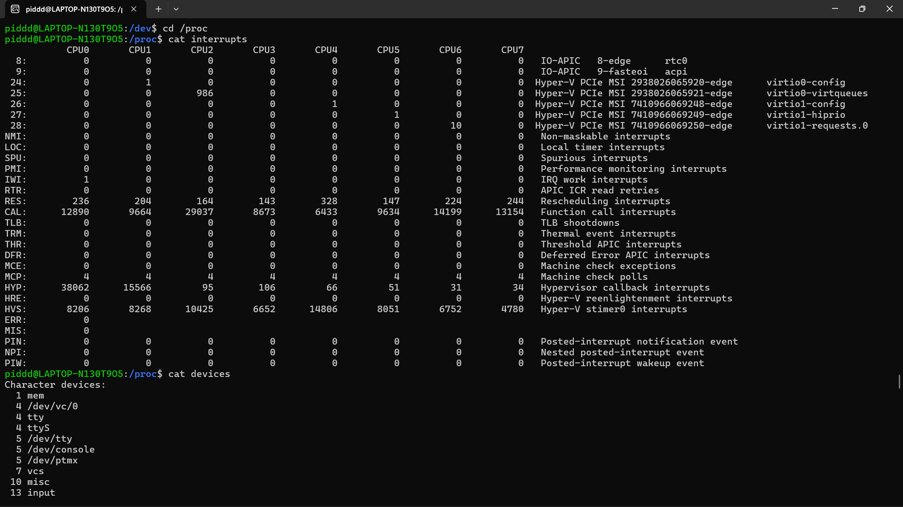
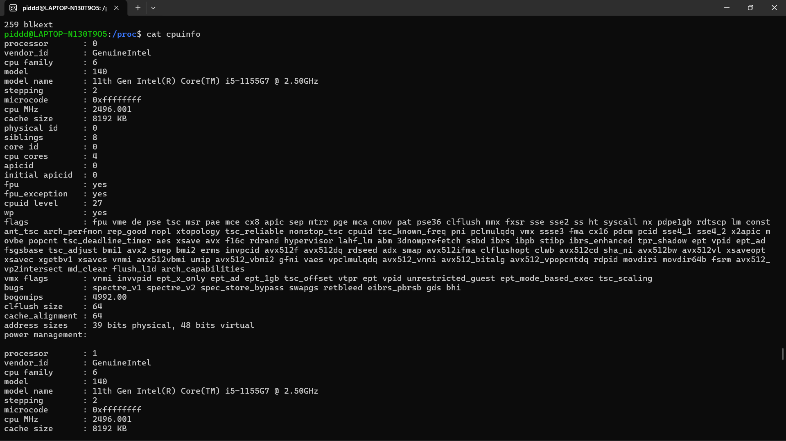
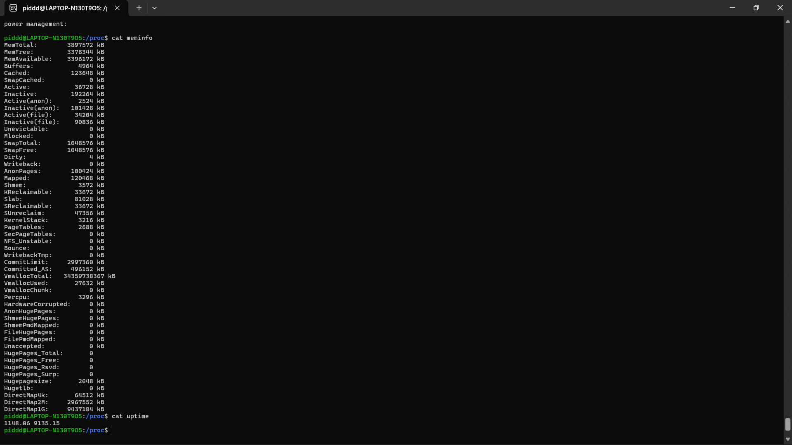

5. Ubahlah direktori home ke user lain secara langsung menggunakan cd ~username.
6. Ubah kembali ke direktori home Anda.
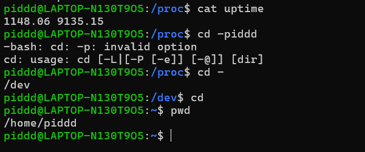

7. Buat subdirektory work dan play.
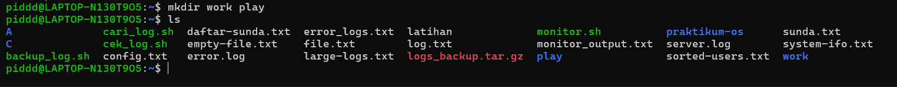

8. Hapus subdirektory work.
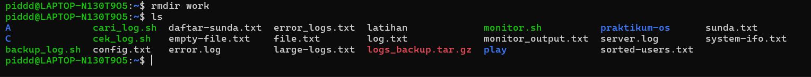

9. Copy file /etc/passwd ke direktori home Anda.
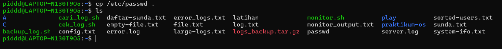

10. Pindahkan ke subdirectory play.
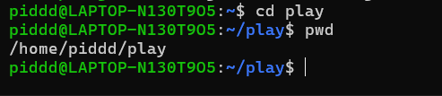

11. Ubahlah ke subdirectory play dan buat symbolic link dengan nama terminal yang menunjuk ke perangkat tty. Apa yang terjadi jika melakukan hard link ke perangkat tty?
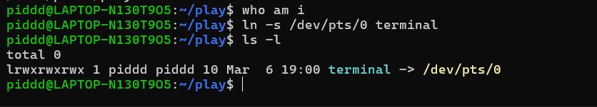

12. Buatlah file bernama hello.txt yang berisi kata "hello word". Dapatkah Anda gunakan "cp" menggunakan "terminal" sebagai file asal untuk menghasilkan efek yang sama?
13. Copy hello.txt ke terminal. Apa yang terjadi?
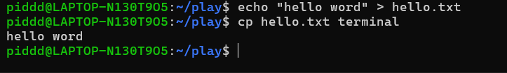

14. Masih di direktory home, copy keseluruhan direktory play ke direktory bernama work menggunakan symbolic link.
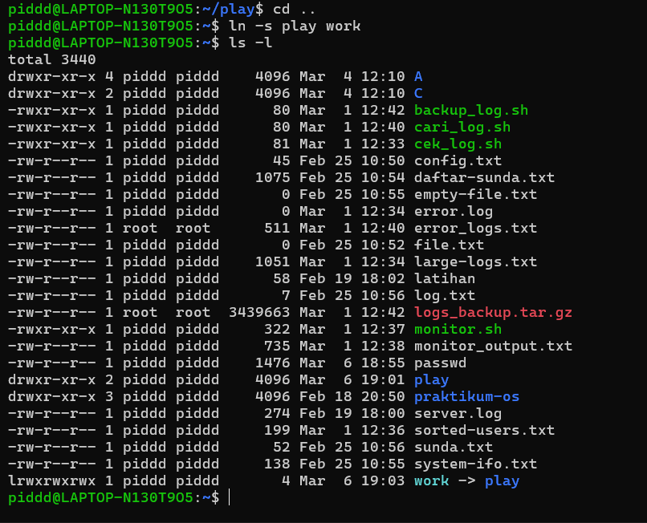

15. Hapus direktory work dan isinya dengan satu perintah.
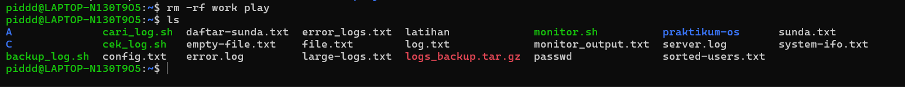

## Laporan
1. Analisa Hasil Percobaan

* Analisa setiap hasil tampilannya.
* Pada Percobaan 1 point 3 buatlah pohon dari struktur file dan direktori
```
[ / ]  (Root)
         |
    +----+----+
    |         |
 [ bin ]   [ dev ]  <-- (Langkah 3 fokus di sini)
              |
      +-------+-------+
      |       |       |
   [ tty1 ] [ pts ] [ sda1 ]
              |
           [  0  ]  <-- (Ini terminalmu jika hasil 'who am i' adalah pts/0)
```
* Bila terdapat pesan error, jelaskan penyebabnya.

Jawab : 

Jika muncul pesan error, berikut penyebab utamanya:
- Permission Denied: * Penyebab: Kamu mencoba masuk ke folder milik user lain atau sistem yang dikunci. User biasa tidak punya izin akses ke sana.
- No such file or directory: * Penyebab: Salah ketik nama file/folder atau mencoba membuka file yang memang belum dibuat.
- Directory not empty: * Penyebab: Menggunakan perintah rmdir pada folder yang masih ada isinya. Folder harus kosong dulu baru bisa dihapus pakai perintah itu.
- Operation not permitted: * Penyebab: Mencoba membuat Hard Link ke file perangkat (seperti terminal/tty). Linux hanya mengizinkan Symbolic Link (-s) untuk file jenis ini.

2. *Kesimpulan*

" Kesimpulan dari praktikum ini adalah kita belajar bahwa struktur folder di Linux diatur secara rapi dan hierarkis, yang semuanya bermula dari satu titik utama yaitu Root (/). Kita juga membuktikan salah satu konsep terpenting dalam Linux, yaitu "Everything is a file", di mana perangkat keras seperti layar terminal pun dianggap sebagai file yang bisa kita kelola. Selain itu, kita sekarang jadi paham cara navigasi cepat menggunakan terminal, cara membuat folder, hingga cara membuat pintasan (symbolic link) untuk mempermudah pekerjaan. Intinya, terminal bukan sekadar tempat mengetik perintah, tapi alat sakti untuk mengontrol seluruh isi dan perangkat komputer secara langsung. "