# Laporan Praktikum Sistem Operasi Jobsheet 6

<h4> Nama   : Ahmad Rafid Riqkullah <h4>
<h4> NIM    : 254107020078 <h4>
<h4> Kelas  : TI-1G <h4>

# Manajemen Proses
## Praktikum 6.1 — Melihat Proses dan Thread

## Latihan 6.1
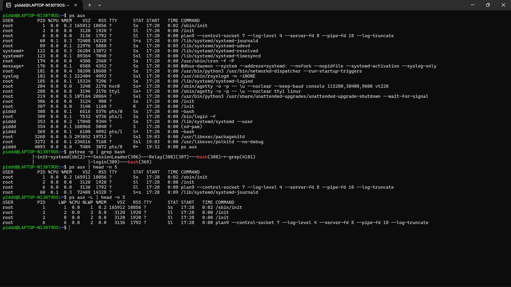
* Jalankan ps aux dan amati outputnya:
1. Berapa total proses yang berjalan? Proses apa yang memiliki PID terkecil?
2. Jalankan pstree -p dan temukan proses bash Anda. Proses apa yang menjadi induk (PPID) dari bash tersebut?
3. Bandingkan output ps aux dan ps aux -L. Apa perbedaan yang Anda lihat?
* Jawaban Latihan 6.1
1. Total & PID Terkecil: Ada banyak proses yang berjalan. Proses dengan PID paling kecil adalah PID 1, yaitu proses 'init' (bisa dibilang ini "bapak" dari semua proses di Linux).
2. Induk proses bash: Dari gambar pstree, proses bash (terminalmu) dihidupkan oleh induk proses bernama 'Relay' atau 'login'.
3. Beda ps aux dan ps aux -L: Kalau pakai tambahan -L, Linux akan memunculkan detail LWP dan NLWP. Intinya, ini untuk melihat thread (anak cabang atau tugas-tugas kecil dari sebuah proses utama).

## Praktikum 6.2 — Mengamati Siklus Hidup Proses
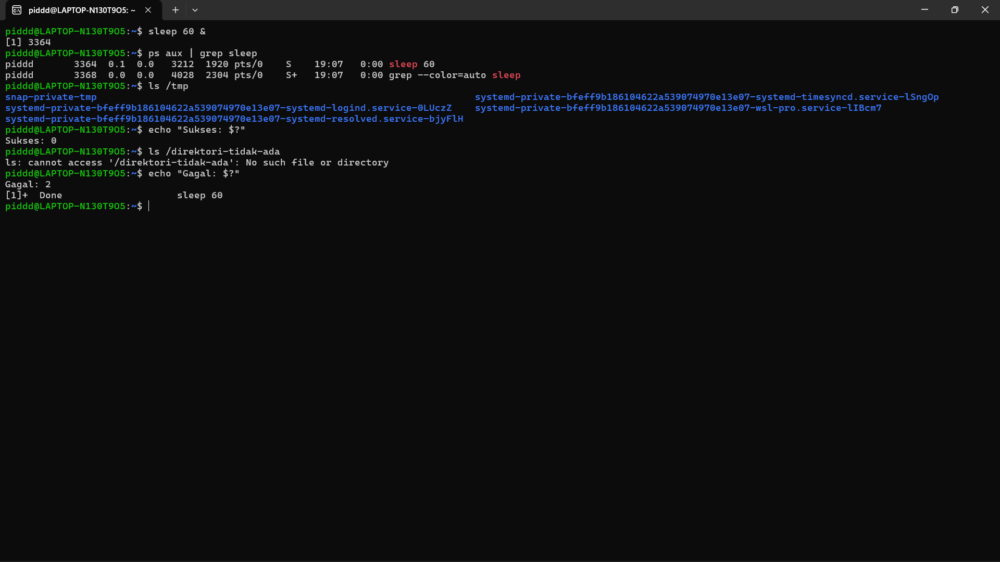

## Latihan 6.2

1. Jalankan sleep 120 & dan amati kolom STAT pada ps aux. Kondisi apa yang ditampilkan? Mengapa proses sleep berada di kondisi tersebut?
2. Jalankan beberapa perintah yang berhasil dan yang gagal, lalu catat exit code masing-masing. Pola apa yang Anda temukan?
* Jawaban Latihan 6.2
1. Kondisi sleep 120: Statusnya adalah S (Sleep). Artinya, proses ini sedang "tidur" atau istirahat sebentar karena sedang menunggu waktu 120 detiknya habis.
2. Pola Exit Code: Kalau perintahnya berhasil/sukses, kodenya adalah 0. Tapi kalau perintahnya gagal atau ada error, kodenya berupa angka selain nol (misalnya angka 2).

## Praktikum 6.3 — Mengatur Prioritas Proses
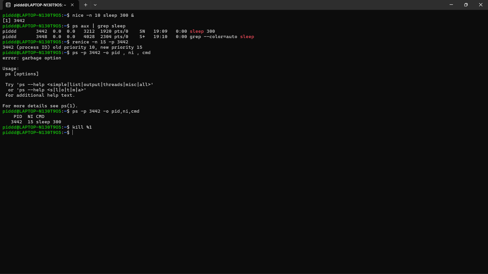

## Latihan 6.3
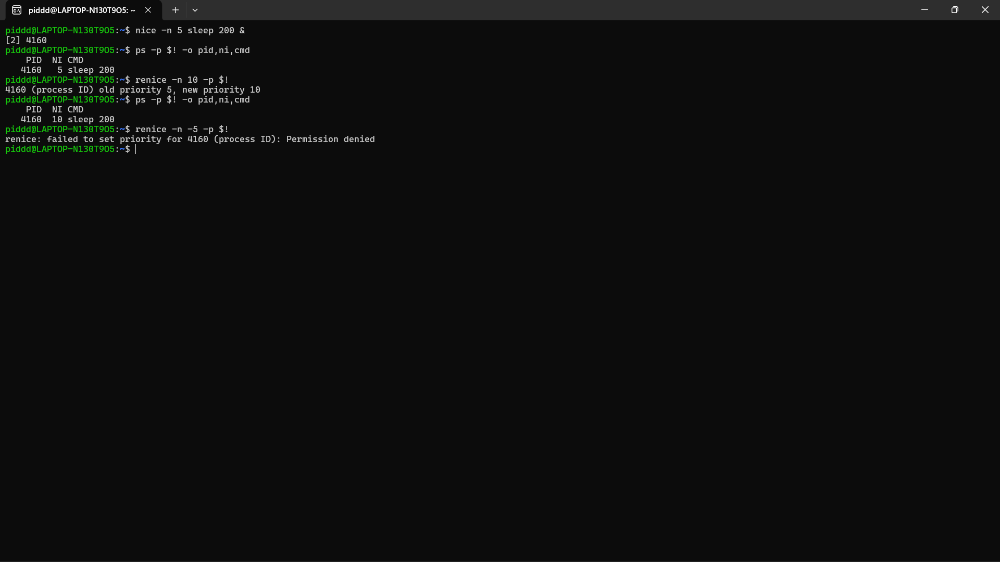
1. Jalankan nice -n 5 sleep 200 & dan verifikasi nilai NI-nya dengan ps.
2. Ubah nilai nice menjadi 10 menggunakan renice, lalu verifikasi kembali.
3. Coba ubah nilai nice menjadi -5 tanpa sudo. Apa yang terjadi? Mengapa Linux membatasi hal ini untuk user biasa?
* Jawaban Latihan 6.3
1. Cek prioritas (nice): Nilai prioritas awal berhasil diset ke angka 5, lalu saat diubah pakai renice berhasil naik menjadi 10.
2. Kenapa ditolak saat ubah ke -5 tanpa sudo? Di Linux, mengubah nilai ke minus (-) artinya membuat program itu lebih diprioritaskan oleh CPU. Aturannya, user biasa tidak boleh melakukan ini agar tidak serakah menghabiskan kinerja CPU. Hanya Admin/Root (sudo) yang boleh menaikkan prioritas.

## Praktikum 6.4 — Mengirim Sinyal ke Proses
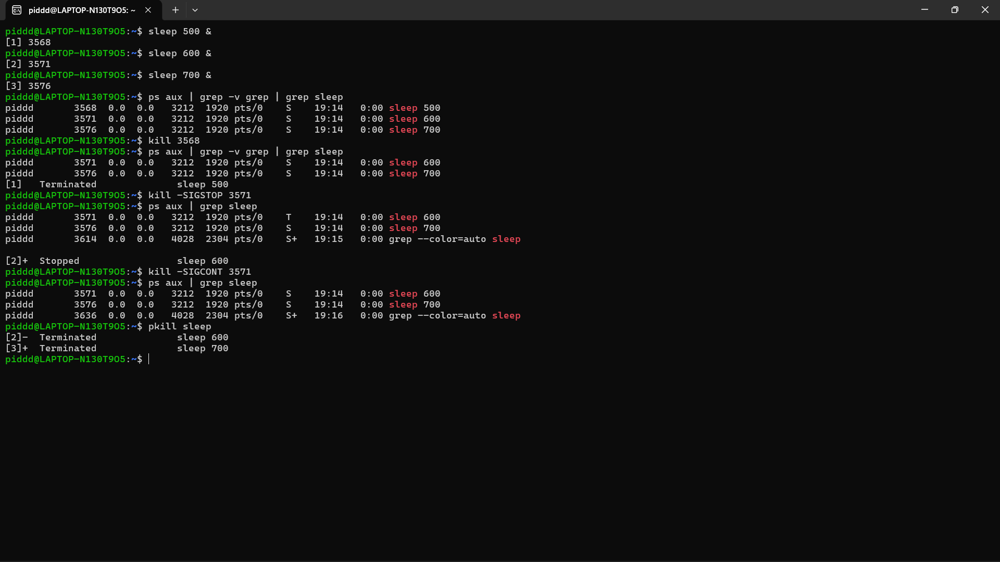

## Latihan 6.4
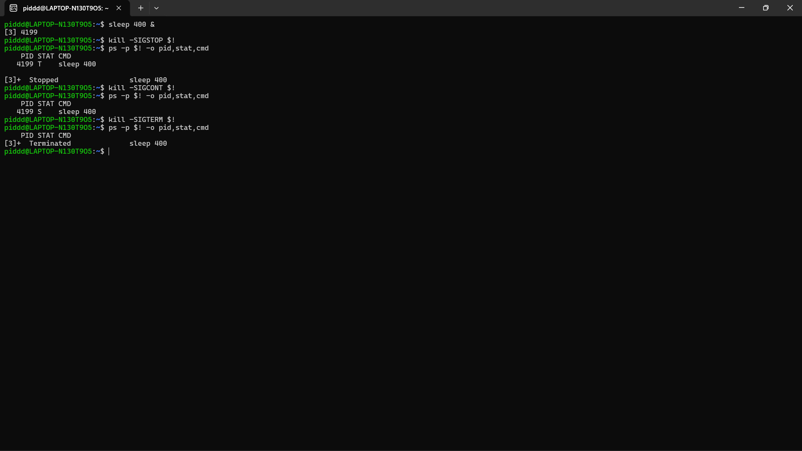
1. Jalankan sleep 400 &, kirim SIGSTOP, dan amati perubahan kolom STAT. Kondisi apa yang muncul?
2. Kirim SIGCONT dan verifikasi proses kembali berjalan.
3. Hentikan proses dengan SIGTERM lalu verifikasi sudah tidak ada. Kapan Anda memilih SIGKILL daripada SIGTERM?
* Jawaban Latihan 6.4
1. Status dijeda & dilanjut: Setelah dikirim sinyal SIGSTOP, statusnya berubah jadi T (Stopped/Dijeda). Saat dikirim SIGCONT (dilanjutkan), statusnya kembali normal jadi S (Sleep).
2. Kapan pilih SIGKILL vs SIGTERM? Normalnya kita pakai SIGTERM untuk menutup program secara baik-baik. Tapi kalau programnya error, hang (not responding), atau bandel nggak mau ditutup, barulah kita tembak pakai SIGKILL untuk mematikannya secara paksa saat itu juga.

## Praktikum 6.5 — Manajemen Job Foreground dan Background
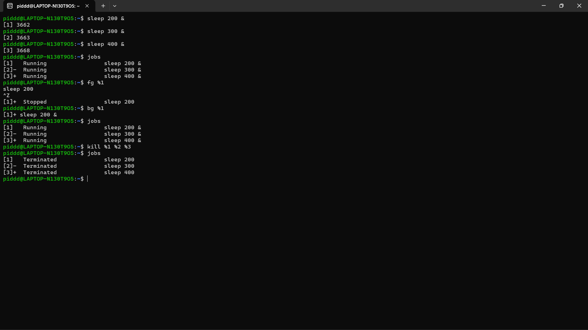

## Latihan 6.5
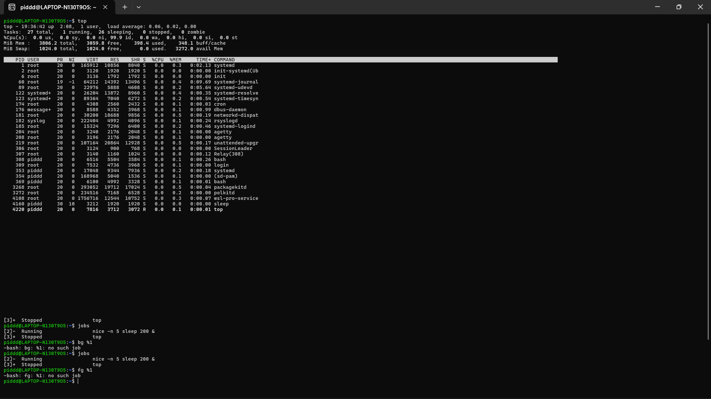
1. Jalankan top di foreground. Apa yang terjadi di terminal?
2. Tekan Ctrl+Z dan cek statusnya dengan jobs. Kondisi apa yang ditampilkan?
3. Pindahkan ke background dengan bg. Apakah top dapat berjalan dengan baik di background? Mengapa?
4. Kembalikan ke foreground dengan fg, lalu keluar dengan q .
* Jawaban Latihan 6.5
1. Saat top jalan: Layar terminal langsung penuh menampilkan statistik performa komputer secara real-time (angka-angkanya terus bergerak).
2. Status setelah Ctrl+Z: Program top langsung terjeda sementara (statusnya berubah menjadi Stopped).
3. Apakah top bisa jalan di background? Tidak bisa. Program top itu wajib tampil di layar utama untuk memunculkan data. Kalau dipindah ke background (belakang layar), dia akan otomatis berhenti/terjeda lagi.

## Praktikum 6.6 — Pemantauan Proses
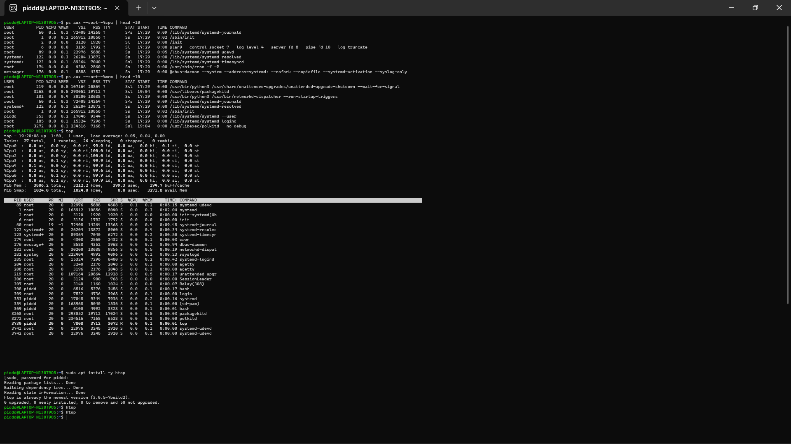

## Latihan 6.6
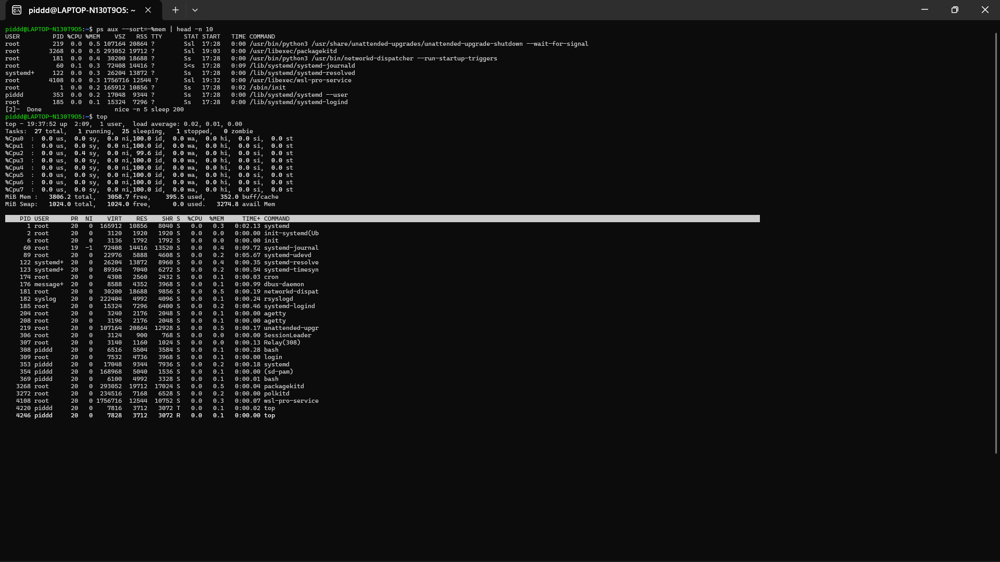

1. Gunakan ps aux –sort=%mem untuk menemukan proses yang menggunakan memori paling banyak di VM Anda. Proses apa itu?
2. Di dalam top, tekan 1 . Apa yang berubah pada tampilan? Mengapa informasi ini berguna?
3. Di dalam htop, navigasikan ke proses sshd menggunakan tombol panah. Tekan F9 dan amati opsi sinyal yang tersedia
* Jawaban Latihan 6.6
1. Proses paling boros memori: Di komputermu, proses yang paling banyak memakan RAM adalah unattended-upgrade (ini adalah program bawaan Linux untuk melakukan update sistem secara otomatis).
2. Fungsi tekan '1' di top: Untuk melihat beban kinerja CPU secara lebih rinci. Kita jadi bisa memantau performa tiap-tiap inti (core) prosesor secara terpisah (dari Cpu0 sampai Cpu7), bukan cuma nilai rata-rata gabungannya.
3. Fungsi tekan 'F9' di htop: Untuk memunculkan daftar "Sinyal Aksi" di sisi kiri layar. Lewat daftar ini, kita bisa memilih mau mengirim perintah apa ke suatu proses dengan mudah (misalnya mengirim sinyal kill, stop, atau continue).

# 1.8 Latihan
## Latihan 6.A
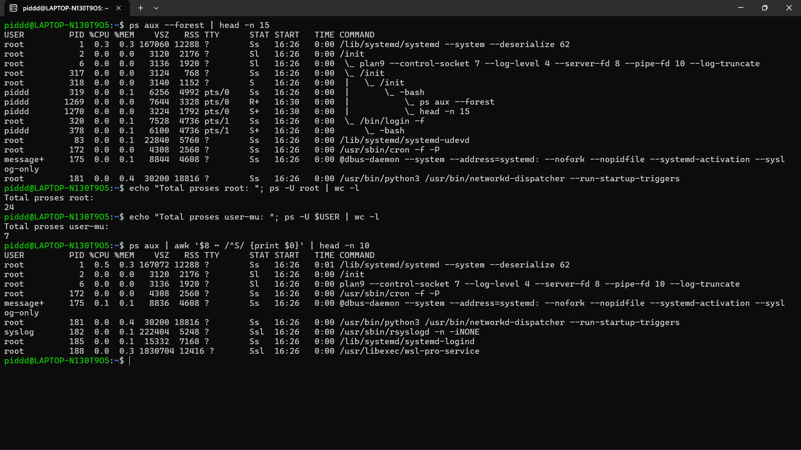
* Eksplorasi Proses Sistem
1. Jalankan ps aux –forest dan temukan proses dengan PID 1. Apa nama dan fungsi proses tersebut dalam sistem Linux modern?
2. Hitung berapa proses yang dimiliki oleh user root dan berapa yang dimiliki oleh user Anda. Mengapa root memiliki lebih banyak proses?
3. Temukan semua proses yang berada dalam kondisi S. Mengapa sebagian besar proses di sistem berada dalam kondisi ini?
* Jawaban Latihan 6.A
1. Proses PID 1: Berdasarkan hasil perintah, proses dengan PID 1 adalah 'systemd'. Dalam sistem Linux modern, systemd berfungsi sebagai sistem init utama (pengelola sistem dan layanan) yang bertugas untuk memulai dan mengelola semua proses lain sejak komputer pertama kali dihidupkan (booting).
2. Jumlah proses root vs user: Terdapat 24 proses milik root dan hanya 7 proses milik user (piddd). User root memiliki jauh lebih banyak proses karena root bertanggung jawab untuk menjalankan dan memelihara berbagai layanan inti sistem operasi di latar belakang (seperti jaringan, pencatatan log, dan manajemen perangkat keras), sedangkan user biasa hanya menjalankan proses untuk aplikasi yang sedang ia pakai.
3. Alasan kondisi 'S' dominan: Sebagian besar proses (seperti systemd, cron, atau networkd-dispatcher) berada dalam kondisi 'S' (Interruptible Sleep). Ini terjadi karena sistem operasi bekerja sangat cepat; sebagian besar program yang berjalan di latar belakang menghabiskan waktunya untuk "tidur" atau menunggu suatu kejadian (event) terjadi, seperti menunggu input dari pengguna, menunggu data dari jaringan, atau menunggu timer habis, sebelum mereka aktif menggunakan CPU kembali.

## Latihan 6.B
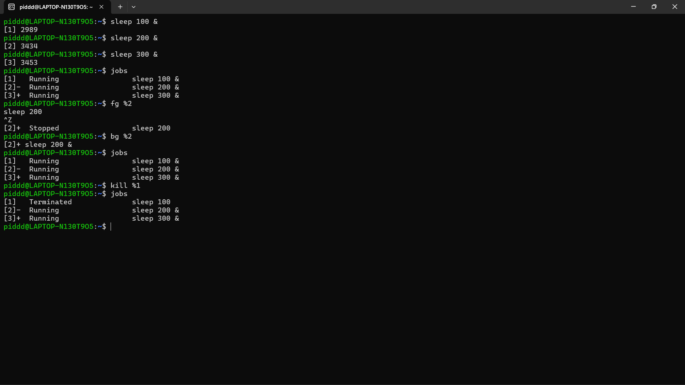
* Simulasi Manajemen Job
1. Jalankan tiga perintah sleep dengan durasi 100, 200, dan 300 detik di background. Verifikasi ketiganya dengan jobs.
2. Bawa job kedua ke foreground, jeda dengan Ctrl+Z , lalu kembalikan ke background dengan bg.
3. Hentikan job pertama dengan kill %1. Tampilkan kembali daftar job. Berapa job yang tersisa?
* Jawaban Latihan 6.B
1. Verifikasi jobs: Tiga proses sleep (100, 200, 300) berhasil dijalankan di background dan terdaftar dalam sistem jobs dengan status 'Running'.
2. Manajemen foreground-background: Job kedua (sleep 200) berhasil dipanggil ke foreground dengan perintah 'fg %2'. Saat ditekan Ctrl+Z, proses tersebut langsung terjeda (status berubah menjadi 'Stopped'). Setelah perintah 'bg %2' dijalankan, proses tersebut kembali dilanjutkan namun berjalan di latar belakang (background).
3. Sisa jobs setelah kill: Setelah job pertama dihentikan (kill %1), statusnya berubah menjadi 'Terminated'. Saat dicek kembali daftar job-nya, kini hanya tersisa 2 job yang masih aktif (Running), yaitu job kedua dan ketiga.

## Latihan 6.C
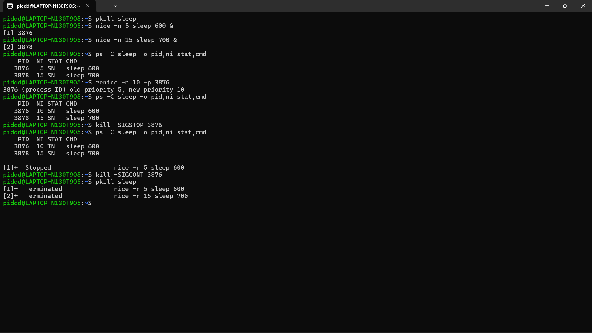
* Prioritas dan Sinyal
1. Jalankan dua proses sleep: satu dengan nice +5 dan satu dengan nice +15. Verifikasi nilai NI keduanya dengan ps.
2. Gunakan renice untuk mengubah nice proses pertama menjadi +10. Proses mana yang kini lebih diprioritaskan scheduler?
3. Kirim SIGSTOP ke salah satu proses, verifikasi kondisi T-nya, lalu kirim SIGCONT. Akhiri semua proses percobaan dengan pkill sleep.
* Jawaban Latihan 6.C
1. Verifikasi nilai NI awal: Kedua proses sleep berhasil dijalankan. Proses pertama memiliki nilai nice (NI) sebesar 5, sedangkan proses kedua memiliki nilai nice sebesar 15.
2. Pengubahan prioritas (renice): Setelah menggunakan renice pada proses pertama (PID 3876), nilai nice-nya berhasil diubah dari 5 menjadi 10. Karena angka nice proses pertama (+10) sekarang lebih kecil daripada angka nice proses kedua (+15), maka proses pertama-lah yang kini lebih diprioritaskan oleh CPU scheduler.
3. Sinyal STOP dan CONT: Sinyal SIGSTOP berhasil dikirim ke proses pertama, hal ini diverifikasi dengan perubahan statusnya pada kolom STAT yang menjadi 'T' (Stopped). Saat sinyal SIGCONT dikirimkan, proses tersebut dilanjutkan kembali dan percobaan diakhiri dengan membersihkan semua proses sleep menggunakan 'pkill'.