# Laporan Praktikum Sistem Operasi Jobsheet 7

<h4> Nama   : Ahmad Rafid Riqkullah <h4>
<h4> NIM    : 254107020078 <h4>
<h4> Kelas  : TI-1G <h4>

# Bash Shell dan Shell Basic
## 1.1 Pengenalan Bash sebagai Shell Default di Linux
### Praktikum 6.1 — Mengenali Bash dan Menyiapkan Workspace
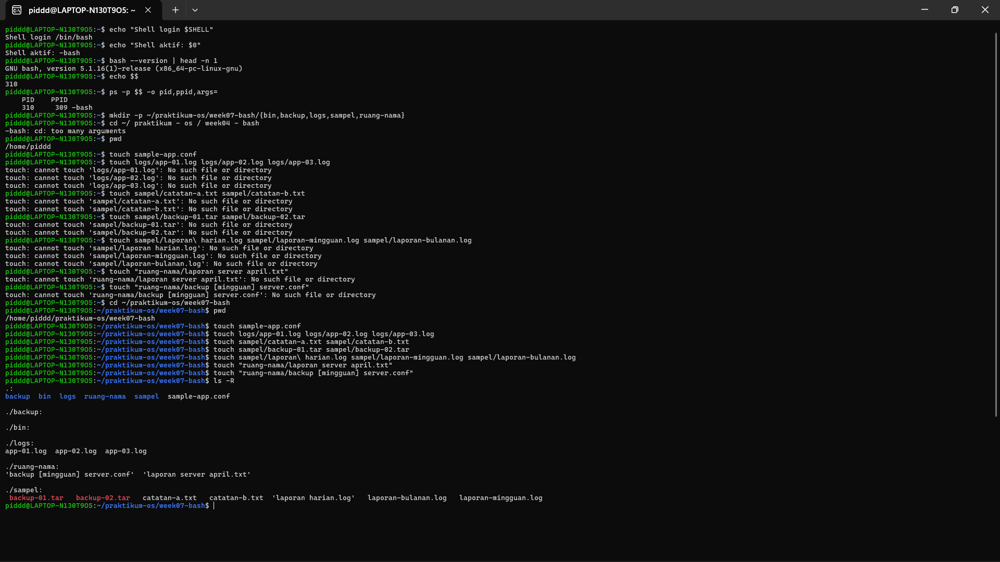
### Praktikum 6.2 — Membuat Ringkasan Sesi Terminal
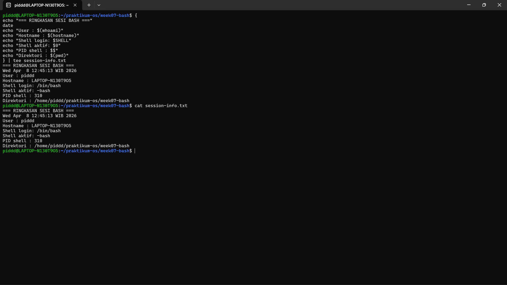

## 1.2 Konfigurasi Bash (.bashrc dan .bash_profile)
### Praktikum 6.3 — Menambahkan Konfigurasi Aman pada .bashrc
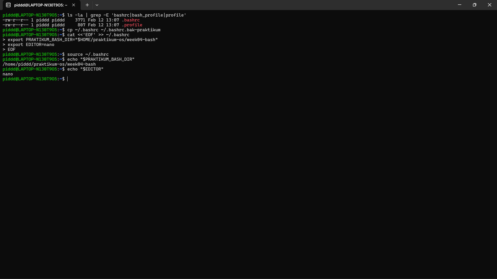
### Praktikum 6.4 — Menyiapkan .bash_profile untuk Shell Login
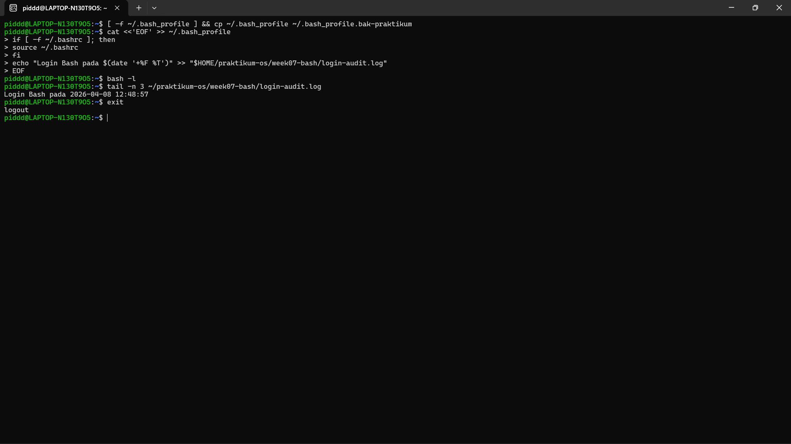

## 1.3 Variabel Lingkungan dan PATH
### Praktikum 6.5 — Membedakan Variabel Shell dan Environment Variable
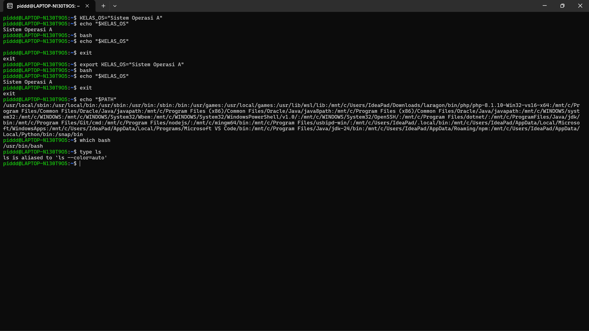
### Praktikum 6.6 — Menambahkan Direktori Script Pribadi ke PATH
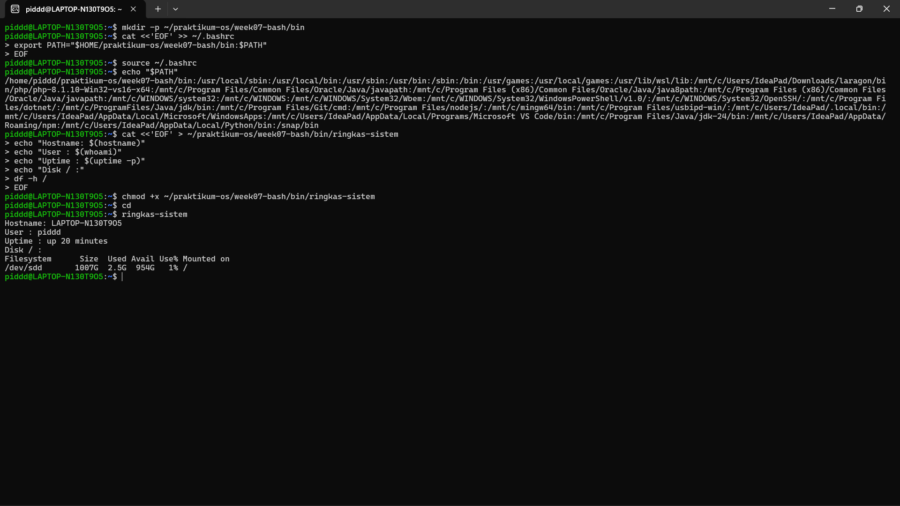

## 1.4 Membuat Alias dan Fungsi Shell
### Praktikum 6.7 — Membuat Alias Produktivitas Dasar
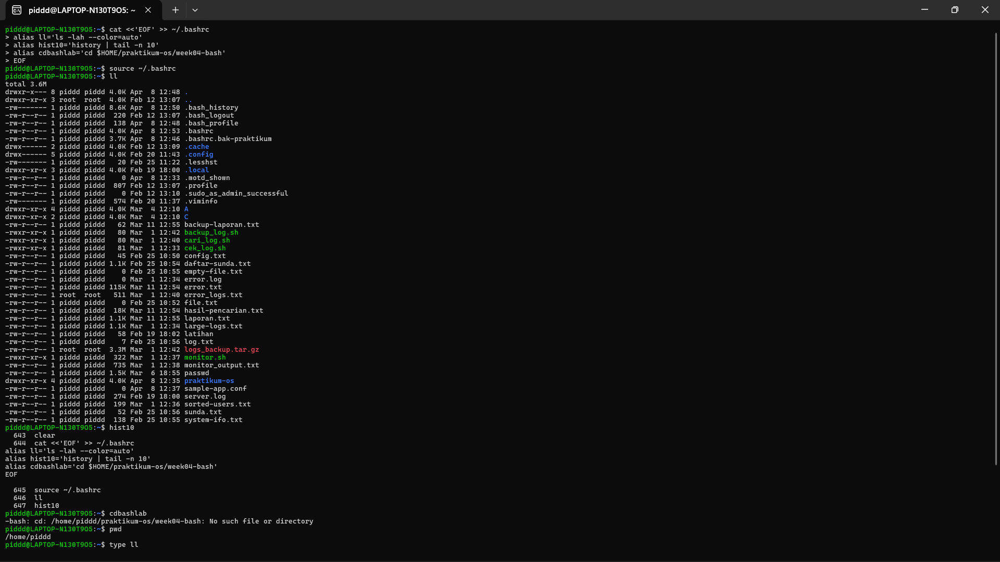
### Praktikum 6.8 — Membuat Fungsi Backup Konfigurasi
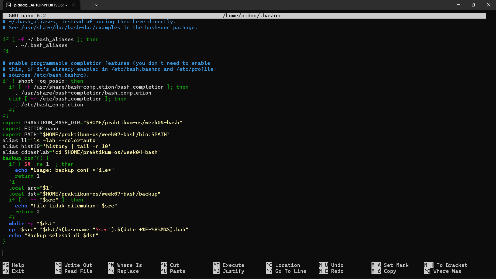
.png "")

## 1.5 Penyelesaian (Completion) dan History Bash
### Praktikum 6.9 — Menggunakan Completion Dasar dan Melihat History
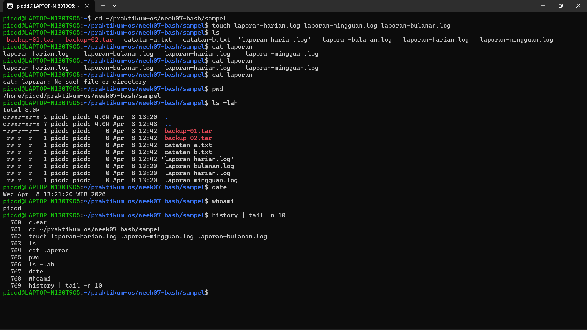
### Praktikum 6.10 — Menelusuri Perintah Diagnostik dengan History
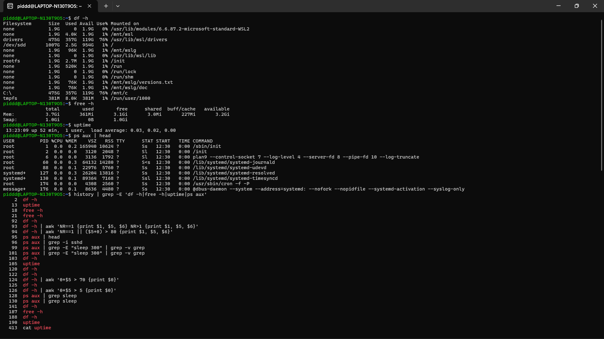

## 1.6 Wildcards dan Ekspansi Nama File
### Praktikum 6.11 — Mencoba Wildcard Dasar
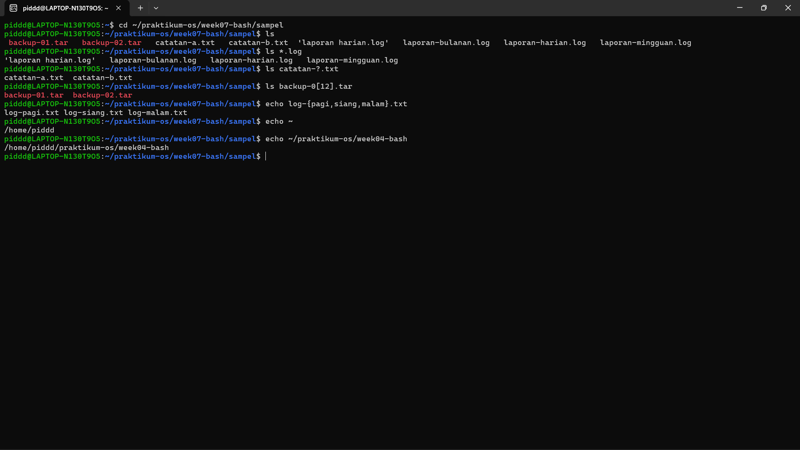
### Praktikum 6.12 — Mengarsipkan Banyak Log Sekaligus
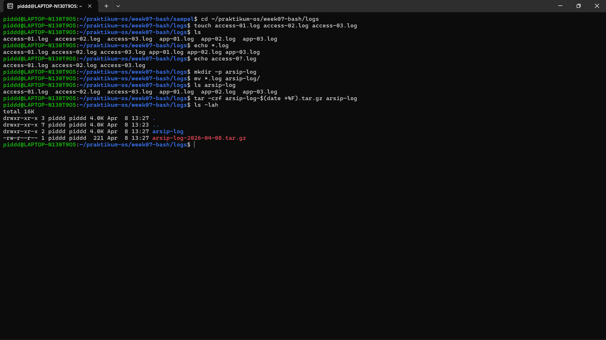

## 1.7 Quoting dan Escaping di Bash
### Praktikum 6.13 — Membedakan Single Quote, Double Quote, dan Escape
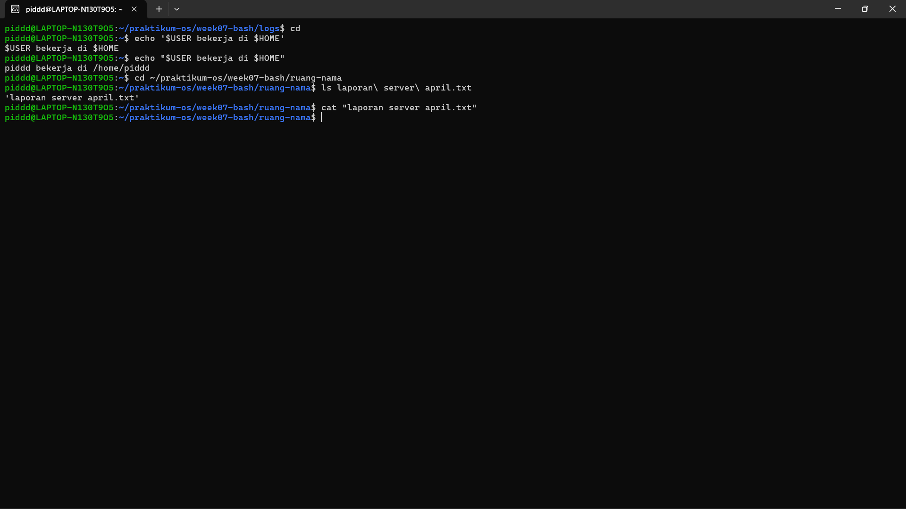
### Praktikum 6.14 — Menangani File dengan Nama Sulit Secara Aman
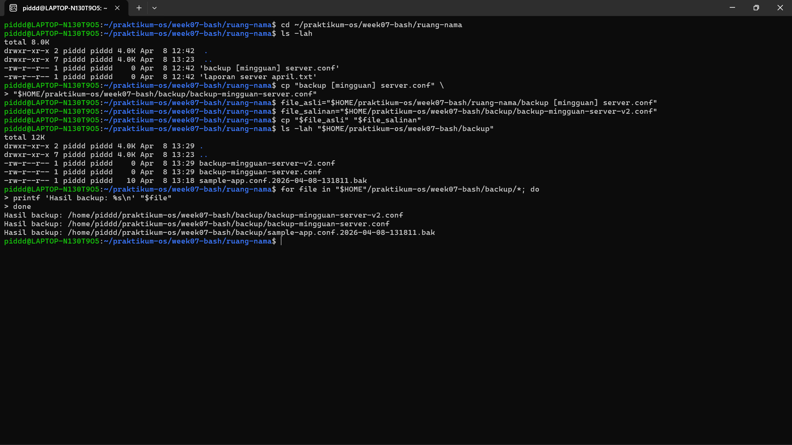

## 1.8 Tugas Praktikum
### Tugas Praktikum 1 — Toolkit Bash Administrator Pribadi

### Tugas Praktikum 2 — Audit File Konfigurasi dan Logging Aman

### Tugas Praktikum 3 — Mini Health Check Harian Server

### Tugas Praktikum 4 — Penanganan File dengan Nama Kompleks dan Arsip Aman

