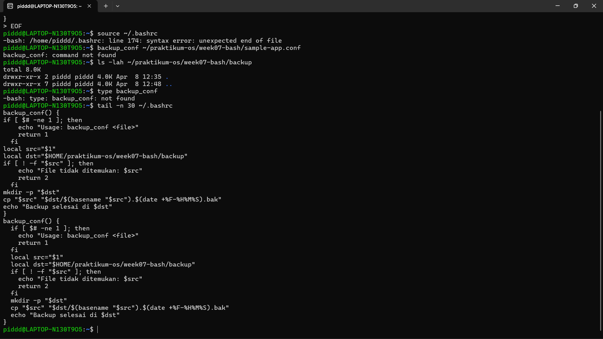
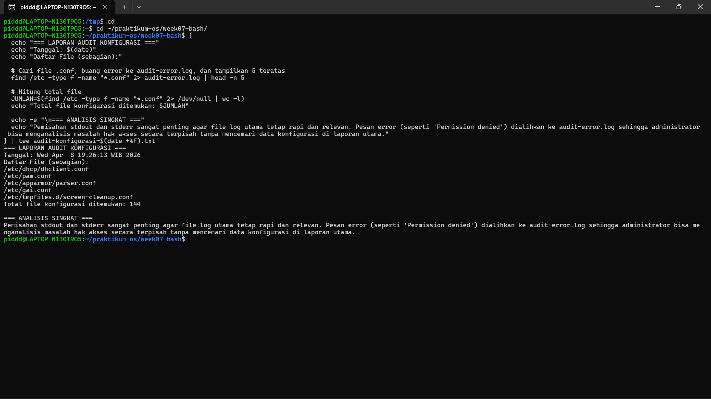
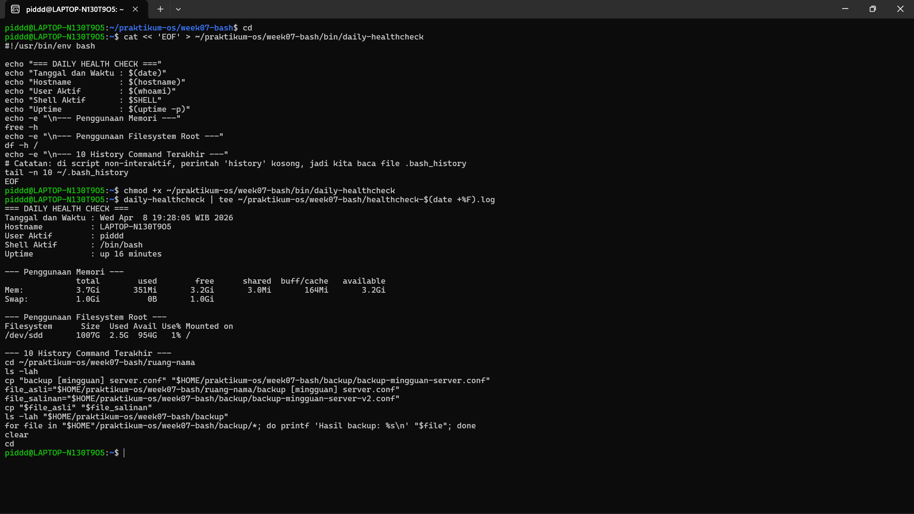
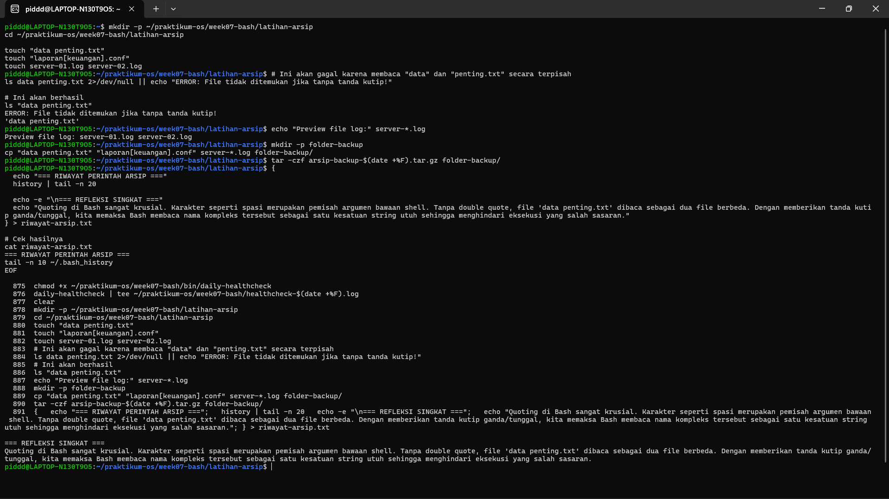

# Laporan Praktikum Sistem Operasi Jobsheet 7

<h4> Nama   : Ahmad Rafid Riqkullah <h4>
<h4> NIM    : 254107020078 <h4>
<h4> Kelas  : TI-1G <h4>

# Bash Shell dan Shell Basic
## 1.1 Pengenalan Bash sebagai Shell Default di Linux
### Praktikum 6.1 — Mengenali Bash dan Menyiapkan Workspace

### Praktikum 6.2 — Membuat Ringkasan Sesi Terminal

## 1.2 Konfigurasi Bash (.bashrc dan .bash_profile)
### Praktikum 6.3 — Menambahkan Konfigurasi Aman pada .bashrc

### Praktikum 6.4 — Menyiapkan .bash_profile untuk Shell Login

## 1.3 Variabel Lingkungan dan PATH
### Praktikum 6.5 — Membedakan Variabel Shell dan Environment Variable

### Praktikum 6.6 — Menambahkan Direktori Script Pribadi ke PATH

## 1.4 Membuat Alias dan Fungsi Shell
### Praktikum 6.7 — Membuat Alias Produktivitas Dasar

### Praktikum 6.8 — Membuat Fungsi Backup Konfigurasi

.png "")

## 1.5 Penyelesaian (Completion) dan History Bash
### Praktikum 6.9 — Menggunakan Completion Dasar dan Melihat History

### Praktikum 6.10 — Menelusuri Perintah Diagnostik dengan History

## 1.6 Wildcards dan Ekspansi Nama File
### Praktikum 6.11 — Mencoba Wildcard Dasar

### Praktikum 6.12 — Mengarsipkan Banyak Log Sekaligus

## 1.7 Quoting dan Escaping di Bash
### Praktikum 6.13 — Membedakan Single Quote, Double Quote, dan Escape

### Praktikum 6.14 — Menangani File dengan Nama Sulit Secara Aman

## 1.8 Tugas Praktikum
### Tugas Praktikum 1 — Toolkit Bash Administrator Pribadi

* Pada tugas ini, direktori script pribadi (~/praktikum-os/week07-bash/bin) berhasil ditambahkan ke dalam variabel lingkungan PATH melalui modifikasi file .bashrc. Keberhasilan ini dibuktikan dengan tereksekusinya script ringkasan-server dari sembarang direktori (misalnya /tmp) tanpa perlu mengetikkan jalur (path) lengkapnya. Selain itu, pendefinisian 2 alias pendukung (update-sistem dan cek-port) serta 1 fungsi shell (fungsi_cek_ip) juga berhasil diregistrasi oleh sistem, yang dikonfirmasi melalui output perintah type.

### Tugas Praktikum 2 — Audit File Konfigurasi dan Logging Aman

* Proses inventarisasi file konfigurasi di dalam direktori /etc berjalan dengan baik menggunakan perintah pencarian. Praktik logging yang aman berhasil diimplementasikan dengan memanfaatkan fitur error redirection (2>). Dengan metode ini, pesan error (seperti kendala izin akses atau Permission denied) sukses dipisahkan dan dialihkan ke dalam file audit-error.log. Output file normal beserta hasil analisis administrator kemudian ditampilkan ke terminal dan disimpan secara serentak ke dalam file laporan menggunakan perintah tee.

### Tugas Praktikum 3 — Mini Health Check Harian Server

* Script otomatis daily-healthcheck berhasil dibuat untuk mengumpulkan status kondisi server secara instan. Script ini memanfaatkan kombinasi command substitution dan variabel lingkungan untuk menampilkan data real-time, seperti identitas pengguna, hostname, memori, hingga metrik penyimpanan disk. Riwayat 10 perintah terakhir juga berhasil ditampilkan dengan membaca file .bash_history. Eksekusi script ini kemudian direkam dengan rapi ke dalam file berekstensi .log sebagai dokumentasi pemeriksaan harian.

### Tugas Praktikum 4 — Penanganan File dengan Nama Kompleks dan Arsip Aman

* Tugas ini mendemonstrasikan krusialnya teknik quoting dalam Bash. Pengujian membuktikan bahwa nama file yang mengandung spasi (seperti "data penting.txt") akan memicu error jika diakses tanpa tanda kutip, karena sistem memproses spasi sebagai pemisah argumen. Dengan menggunakan double quotes, file bernama kompleks tersebut dapat dikelola dan disalin dengan aman. Lebih lanjut, praktik aman sebelum memproses banyak file dilakukan dengan melihat preview wildcard menggunakan echo , dan seluruh file backup tersebut sukses diarsipkompresi ke dalam format .tar.gz.
