# Laporan Praktikum Sistem Operasi Jobsheet 9

<h4> Nama   : Ahmad Rafid Riqkullah <h4>
<h4> NIM    : 254107020078 <h4>
<h4> Kelas  : TI-1G <h4>

# Pemrograman Bash
## 1.1 Dasar-dasar Scripting Bash
### Praktikum 7.1 Script Pertama: Laporan Sistem
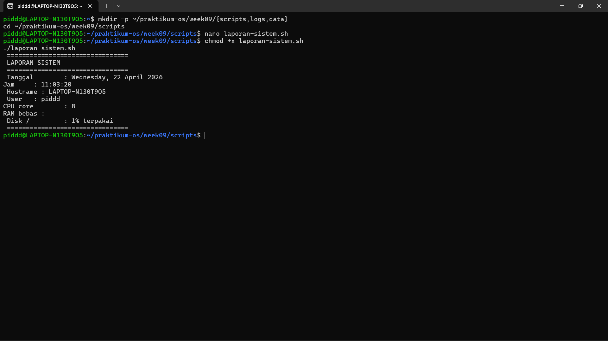
### Latihan 9.1
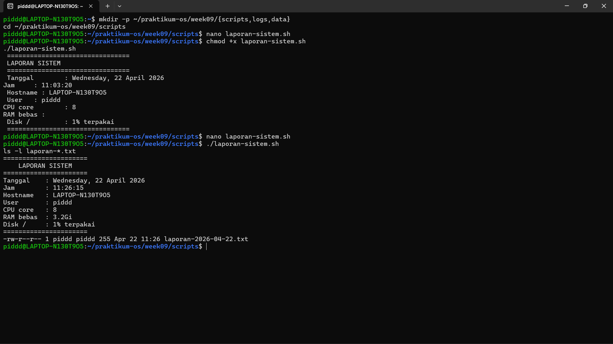

## 1.2 Variabel dan Parameter Posisional
### Praktikum 7.2 Script Info Sistem dengan Argumen
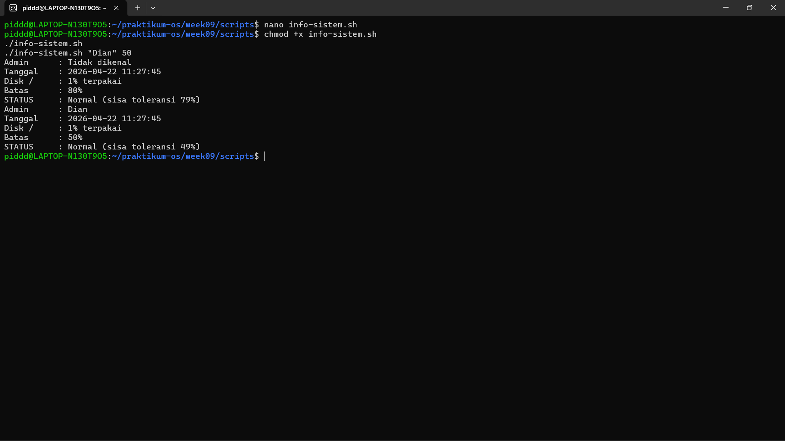
### Latihan 9.2
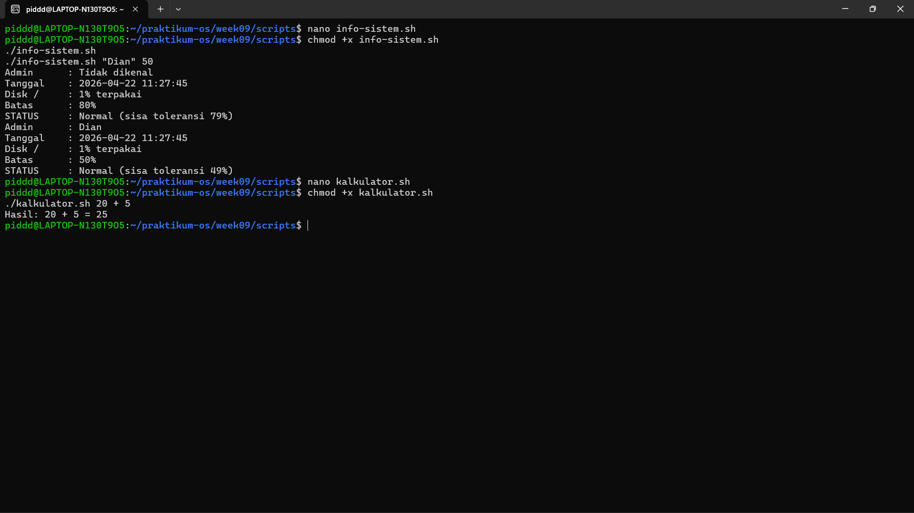

## 1.3 Struktur Kontrol
### Praktikum 7.3 Script Grading dan Menu Interaktif
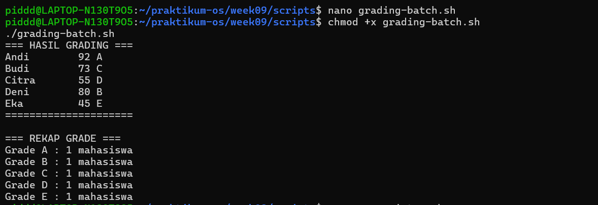
### Latihan 9.3
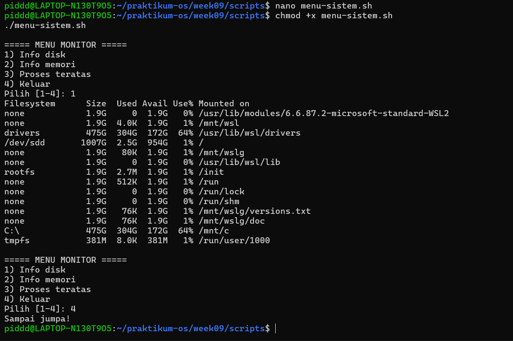

## 1.4 Fungsi dalam Shell Script
### Praktikum 7.4 Library Fungsi Validasi
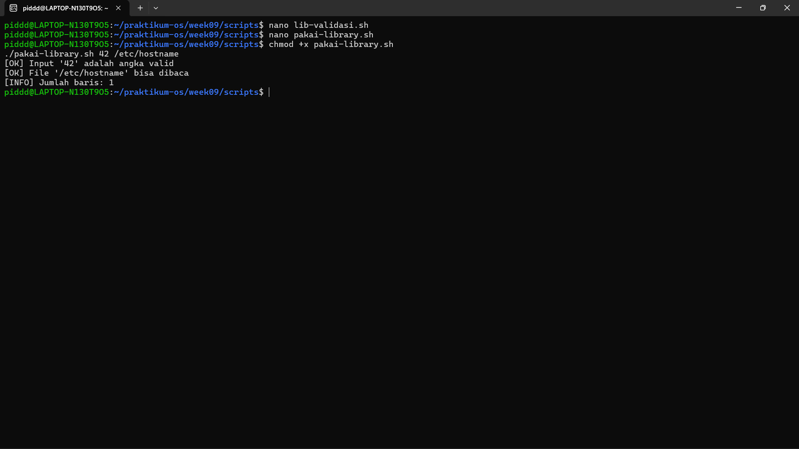
### Latihan 9.4
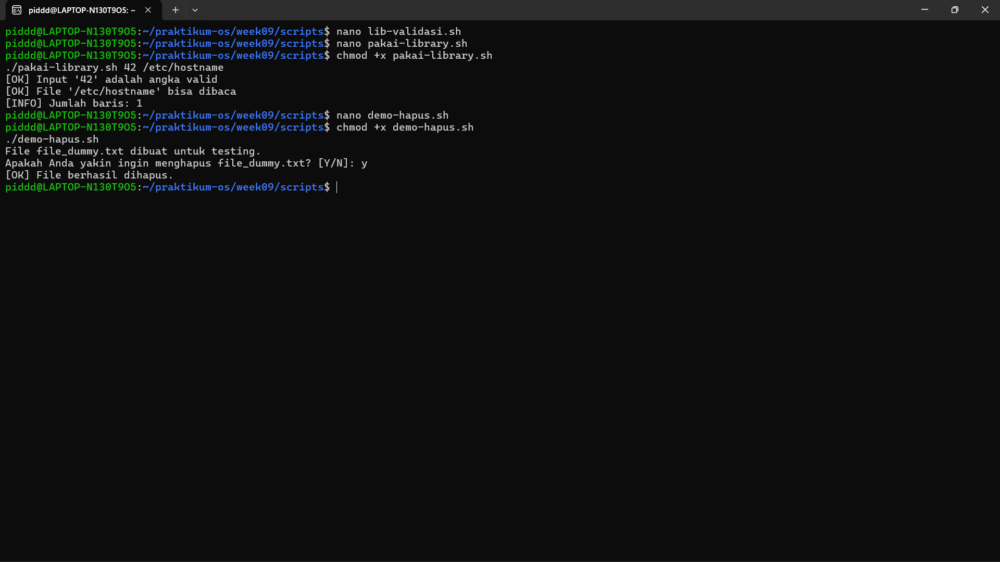

## 1.5 Pengolahan Argumen Command Line
### Praktikum 7.5 Script Backup dengan Opsi
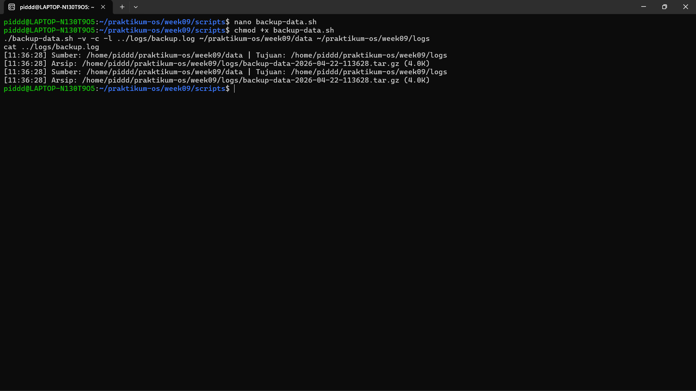

## 1.6 Debugging Shell Script
### Praktikum 7.6 Debugging Script
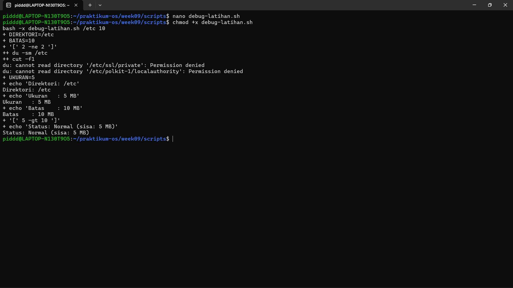
### Latihan 9.5
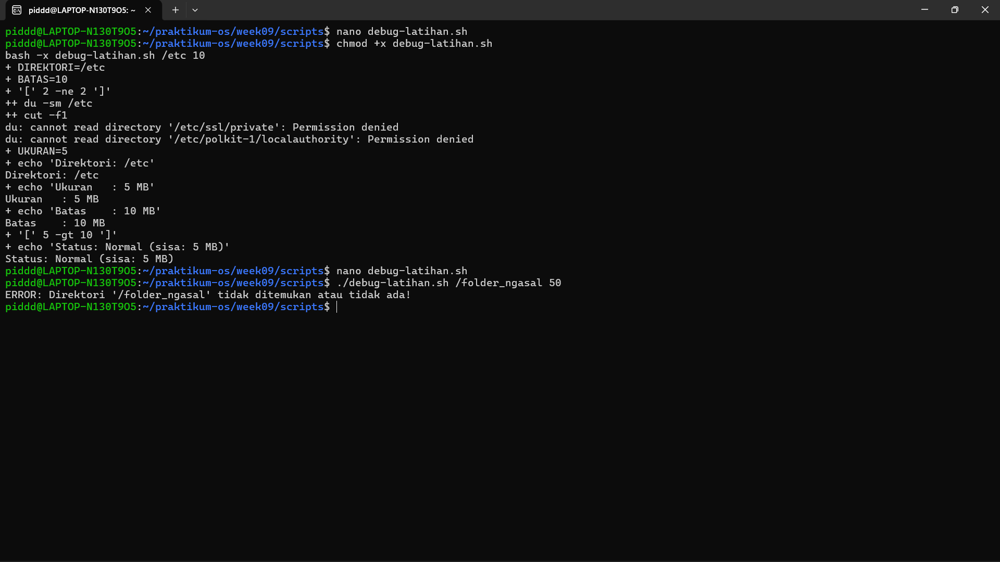

## 1.8 Tugas Praktikum
### Tugas 1 Script Absensi Kelas
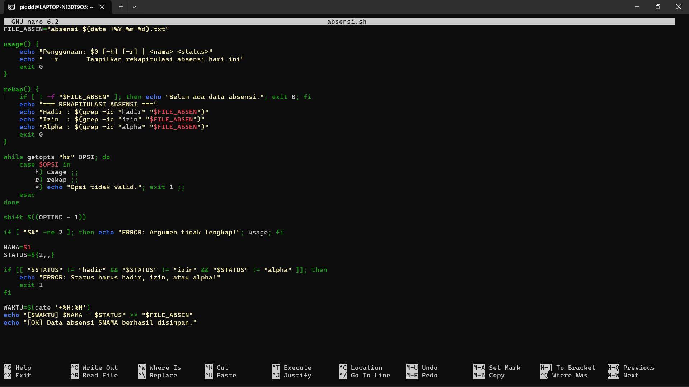
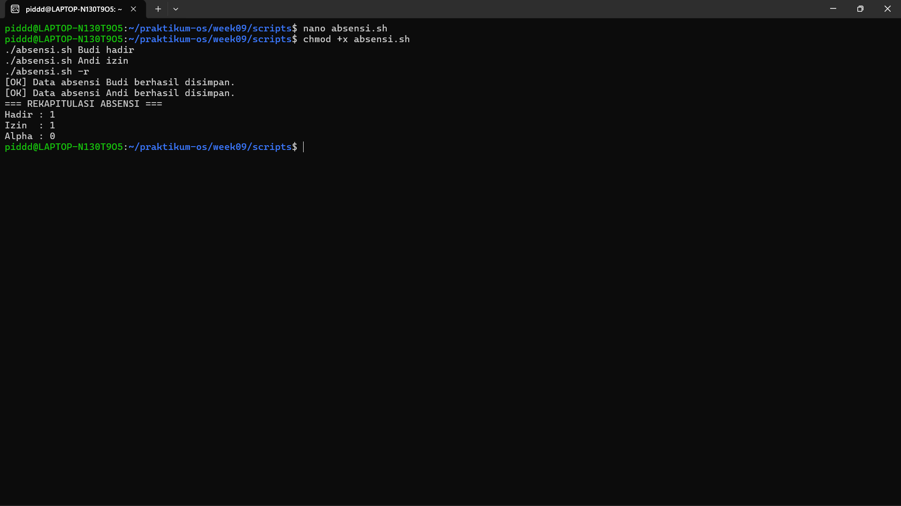

### Tugas 2 Script Health Check Sistem
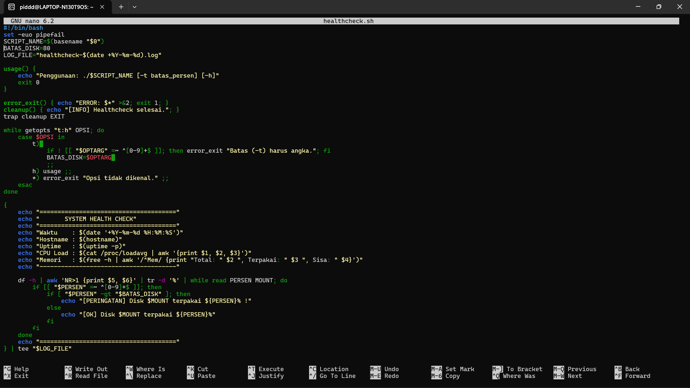
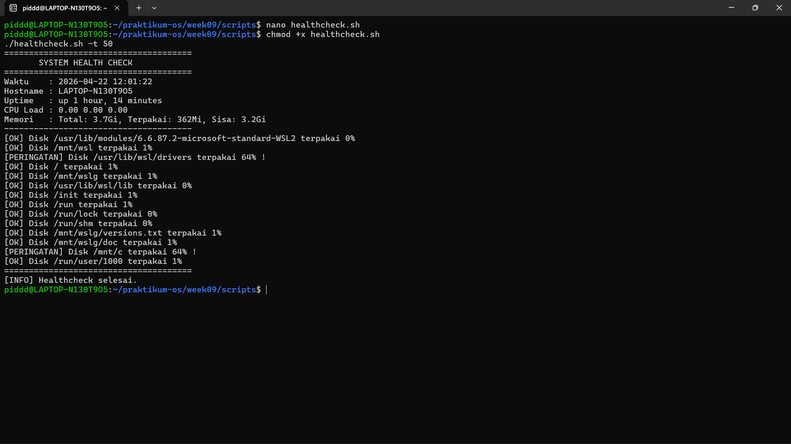